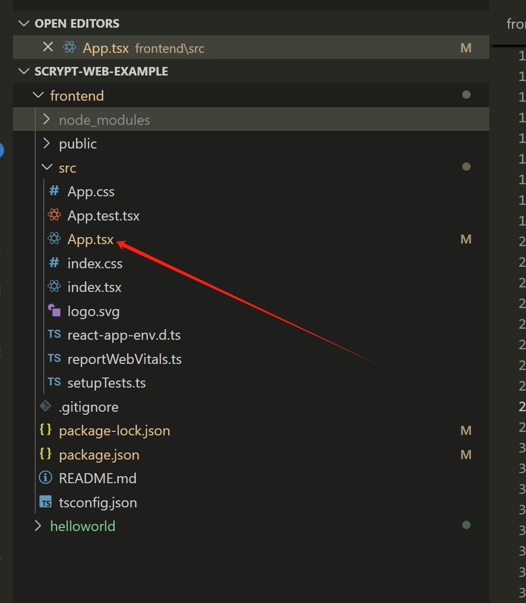
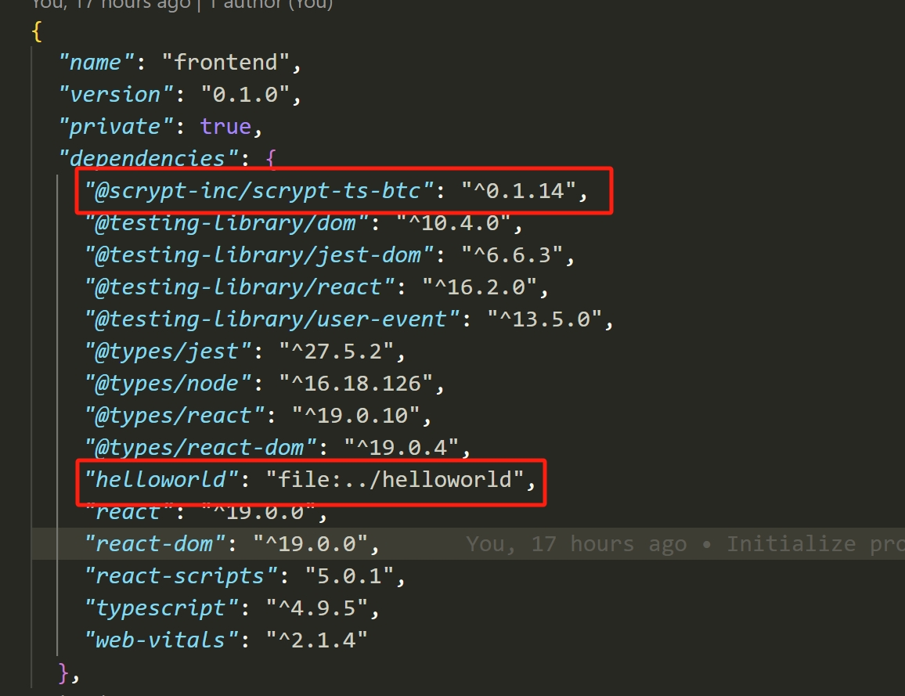

# How to integrate with a front-end

This section will show how to integrate your smart contract to a front-end, so users can interact with it.
We assume that you already have the basic knowledge of front-end development, so we will not spend much time introducing this part of the code, but mostly be focusing on how to interact with the smart contract in the front-end project.

## Create a project

First, create the root directory of the project.

```bash
mkdir scrypt-web-example
cd scrypt-web-example
```

### Create a contract project

Create a `Helloworld` project and build it:

```bash
npx @scrypt-inc/cli-btc project helloworld
cd helloworld
npm run build
```

See the [helloworld tutorial](../tutorials/hello-world.md)

### Create a frontend project


Create your front-end project using React, Next, Vue, Angular, or Svelte.

### React

Run the following command to create a [React](https://react.dev/) project named `helloworld`.

```bash
cd ..
npx create-react-app frontend --template typescript
```



We will do most work under the `src` directory.

### Next.js

Run the following command to create a [Next.js](https://nextjs.org/) project.

```bash
npx create-next-app frontend --typescript --use-npm
```

### Vue.js

#### Vite

Run the following command to create a [Vue](https://vuejs.org/) 3.x project bundled with [Vite](https://vitejs.dev/).

```bash
npm create vue@3
```

If you'd like to use Vue 2.x, run the following command to initialize the project scaffold.

```bash
npm create vue@2
```

#### Webpack

Run the following command to create a [Vue](https://vuejs.org/) project bundled with [Webpack](https://webpack.js.org/).

```bash
npx @vue/cli create frontend
```

:::tip
Vue 3.x and 2.x bundled with Webpack are both supported.
:::

When setting up the project, select `Manually select features` and enable TypeScript.

### Angular

Run the following command to create an [Angular](https://angular.io/) project.

```bash
npx @angular/cli new frontend
```

### Svelte

Run the following command to create a [Svelte](https://svelte.dev/) project.

```bash
npm create svelte@latest frontend
```

:::note
Currently, we support front-end frameworks [React](https://react.dev), [Next.js](https://nextjs.org/), [Vue](https://vuejs.org/), [Angular](https://angular.io/), and [Svelte](https://svelte.dev/). We anticipate to add support for other frameworks over time.
:::

## Install the contract dependency

```bash
cd frontend
npm install @scrypt-inc/scrypt-ts-btc
npm install ../helloworld
```

This command installs the dependencies and configures the contract development environment.
After this, we are ready to go!



## Integrate Wallet

You will integrate [unisat](https://unisat.io), a browser extension wallet, similar to [MetaMask](https://metamask.io/), into the project.

To request access to the wallet, you can use its APIs to create a signer:

```ts
declare global {
	interface Window {
		unisat: UnisatAPI
	}
}
const signer = new UnisatSigner(window.unisat);
```

create a provider:

```ts
const provider = new MempoolProvider('fractal-testnet')
```

create a psbt and use signer and provider to signer and deploy it:

```ts
const address = await signer.getAddress();
const psbt = new ExtPsbt();
const utxos = await provider.getUtxos(address);
const feeRate = await provider.getFeeRate();
psbt.addUTXO(utxos)
    .addCovenantOutput(covenant, satoshis)
    .change(address, feeRate);

// sign the psbts
const [signedPsbtHex] = await signer.signPsbts(psbt.psbtOptions());

// combine and finalize the signed psbts
const signedPsbt = ExtPsbt.fromHex(signedPsbtHex).finalizeAllInputs();

// broadcast the psbts
const deployTx = signedPsbt.extractTransaction();
await provider.broadcast(deployTx.toHex());
```

the scrypt SDK `@scrypt-inc/scrypt-ts-btc` provide `deploy` and `call` features, just use them in `App.tsx`:

```ts
import React from 'react';
import logo from './logo.svg';
import './App.css';
import { call, Covenant, deploy, MempoolProvider, sha256, toByteString, UnisatAPI, UnisatSigner } from '@scrypt-inc/scrypt-ts-btc';
import { Helloworld } from 'helloworld';

declare global {
	interface Window {
		unisat: UnisatAPI
	}
}

async function deployAndCall() {

  const covenant = Covenant.createCovenant(new Helloworld(sha256(toByteString("hello world", true))))

  const provider = new MempoolProvider('fractal-testnet')
  const signer = new UnisatSigner(window.unisat);

  const deployTx = await deploy(signer, provider, covenant);

  console.log(`Helloworld contract deployed: ${deployTx.getId()}`)

  const callTx = await call(signer, provider, covenant, {
      invokeMethod: (contract: Helloworld) => {
        contract.unlock(toByteString('hello world', true));
      },
  });

  console.log('Helloworld contract `unlock` called: ', callTx.getId());
}

function App() {
  return (
    <div className="App">
      <header className="App-header">
        
        <button onClick={deployAndCall}>Deploy and Call</button>
      </header>
    </div>
  );
}

export default App;
```

Afterwards, you can interact with the contract from the front-end.


Go to the [sCrypt Academy](https://academy.scrypt.io) to see a step-by-step guide on how to build a Tic-Tac-Toe game on chain.
