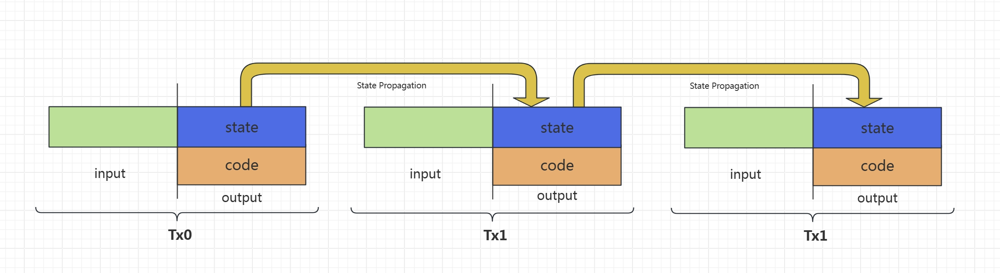

# Stateful Contracts

## Overview

In Bitcoin's UTXO model, a smart contract is one-off and **stateless** by default, since the UTXO containing the contract is destroyed after being spent. Being stateless allows it to scale, similar to [HTTP](https://stackoverflow.com/questions/5836881/stateless-protocol-and-stateful-protocol) and [REST APIs](https://www.geeksforgeeks.org/restful-statelessness/).
A smart contract can simulate state by requiring
the output of the spending transaction containing the same contract but with the updated state, enabled by [ScriptContext](scriptcontext.md).
This is similar to making HTTP seem stateful by using cookies.

### Managing state across bitcoin transactions

So far, all the contracts we’ve gone through have been stateless. But often, you may want a contract to have some concept of “memory” so that it may remember information about its previous interactions. That is, we need contracts that are **stateful**.

To achieve that, we divide a smart contract in the transaction into two parts: 1. code and 2. state, as shown below.

The code part contains the business logic of a contract that encodes rules for state transition and **must not change**.
A state transition occurs when a transaction spends the output in the transaction containing the old state and creates a new transaction containing the new state and keeping the contract code intact.
Since the new output contains the same contract code, its spending transaction must also retain the same code, otherwise it will fail. This chain of transactions can go on and on and thus a state is maintained along the chain, recursively.


## Create a Stateful Contract

We can create a stateful contract using the following command:

```sh
npx scrypt-cli project --state counter
```

Note the `state` option is turned on.

This creates a project containing a sample stateful contract named `Counter`. This basic contract maintains a single state: how many times it has been called since deployment.

Let's take a look at the contract source file `/src/contracts/counter.ts`.

### Stateful User-defined Types

As shown [before](basics#state), smart contracts declare states through generic parameters.

```ts
// declare states
export interface CounterState extends StructObject {
    ...
}

export class Counter extends SmartContract<CounterState> {
    @method()
    public increase() {
        ...
    }
}
```

### Update states

The `increase()` method does two things:

1. Update the current state:

```ts
this.state.count++;
```

1. Validate the new state goes into the next transaction containing the same contract, i.e., the state is maintained.

```ts
// Make sure the state output contains the correct state
this.appendStateOutput(
      // new output of the contract
      TxUtils.buildOutput(this.ctx.spentScript, this.ctx.spentAmount),
      // new state hash of the contract
      Counter.stateHash(this.state),
  );
// outputs containing the latest state and an optional change output
const outputs = this.buildStateOutputs() + this.buildChangeOutput();
// verify unlocking tx has the same outputs
assert(sha256(outputs) === this.ctx.shaOutputs, `output hash mismatch`);
```


```TxUtils.buildOutput(this.ctx.spentScript, this.ctx.spentAmount)``` This line of tokens will ensure that the contract lock script does not change.

The built-in function `Counter.stateHash()` can calculate the hash value of the contract state. This hash value will be stored in an `OP_RETURN` output.

The built-in function `this.appendStateOutput()` creates two outputs:

1. an `OP_RETURN` output containing the latest state hash.
2. an output containing the same locking script of the contract

The built-in function `this.buildStateOutputs()` returns these two outputs.  The built-in function `this.buildChangeOutput()` creates a P2TR change output when necessary. It will calculate the change amount automatically, and use the signer's address by default.

If all outputs we create in the contract hashes to `shaOutputs` in [ScriptContext](scriptcontext.md), we can be sure they are the outputs of the current transaction. Therefore, the updated state is propagated.


The complete stateful contract is as follows:

```ts

export interface CounterState extends StructObject {
    count: Int32;
}

export class Counter extends SmartContract<CounterState> {
    @method()
    public increase() {
        this.state.count++;

        this.appendStateOutput(
            // new output of the contract
            TxUtils.buildOutput(this.ctx.spentScript, this.ctx.spentAmount),
            // new state hash of the contract
            Counter.stateHash(this.state),
        );

        const outputs = this.buildStateOutputs() + this.buildChangeOutput();

        assert(sha256(outputs) === this.ctx.shaOutputs, `outputs hash mismatch`);
    }
}
```

## Common state in diffrent contract

But when you access the same state in different contracts, you need to use `StateLib` instead of `Counter.stateHash(this.state)`.


```ts
export class CounterStateLib extends StateLib<CounterState> {
  @method()
  static checkState(s: CounterState): void {
    assert(s.count >= 0n, 'Invalid count');
  }
}
```


Next, we modify the `Counter` contract. When the `count` state increases to `10`, we hand over the state of the contract to another contract `UnCounter` for maintenance. 


```ts

export class Counter extends SmartContract<CounterState> {

  unCounterScript: ByteString;
  @method()
  public increase() {


    if (this.state.count < 10) {
      this.state.count++;


      this.appendStateOutput(
        // new output of the contract
        TxUtils.buildOutput(this.ctx.spentScript, this.ctx.spentAmount),
        // new state hash of the contract
        // CounterStateLib.stateHash(this.state),
        CounterStateLib.stateHash(this.state),
      );

      const outputs = this.buildStateOutputs() + this.buildChangeOutput();

      assert(this.checkOutputs(outputs), 'Outputs mismatch with the transaction context')
    } else {
      assert(this.ctx.spentScripts[1] === this.unCounterScript);
    }

  }
}
```

`UnCounter` counts down the `count` state.

```ts

export class UnCounter extends SmartContract<CounterState> {

  @method()
  public decrease(
    counterState: CounterState,
  ) {
    const counterInputVal = 0n;
    // check the counter state
    this.checkInputState(counterInputVal, CounterStateLib.stateHash(counterState));
    
    counterState.count--;

    this.appendStateOutput(
      TxUtils.buildOutput(this.ctx.spentScripts[Number(counterInputVal)], this.ctx.spentAmounts[Number(counterInputVal)]),
      CounterStateLib.stateHash(counterState),
    );

    const outputs = this.buildStateOutputs() + this.buildChangeOutput();

    assert(this.checkOutputs(outputs), 'Outputs mismatch with the transaction context')
  }
}
```

## Stateless vs Stateful Contracts

The choice between stateless and stateful smart contracts depends on the needs of your blockchain application.

If your app needs to store persistent data on chain, a stateful smart contract is appropriate. For example, with an [auction app](../tutorials/auction.md), you want to store the highest bidder so far and how much she bids, in case you need to return the fund to her when a higher bid arrives.

If your app merely validates spending conditions without retaining data, a stateless smart contract is desirable. An example is a simple transfer using signature and public key in a [P2PKH contract](../how-to-deploy-and-call-a-contract/how-to-deploy-and-call-a-contract.md#method-with-signatures).
