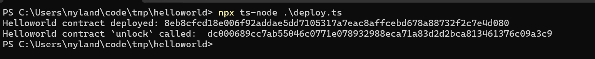
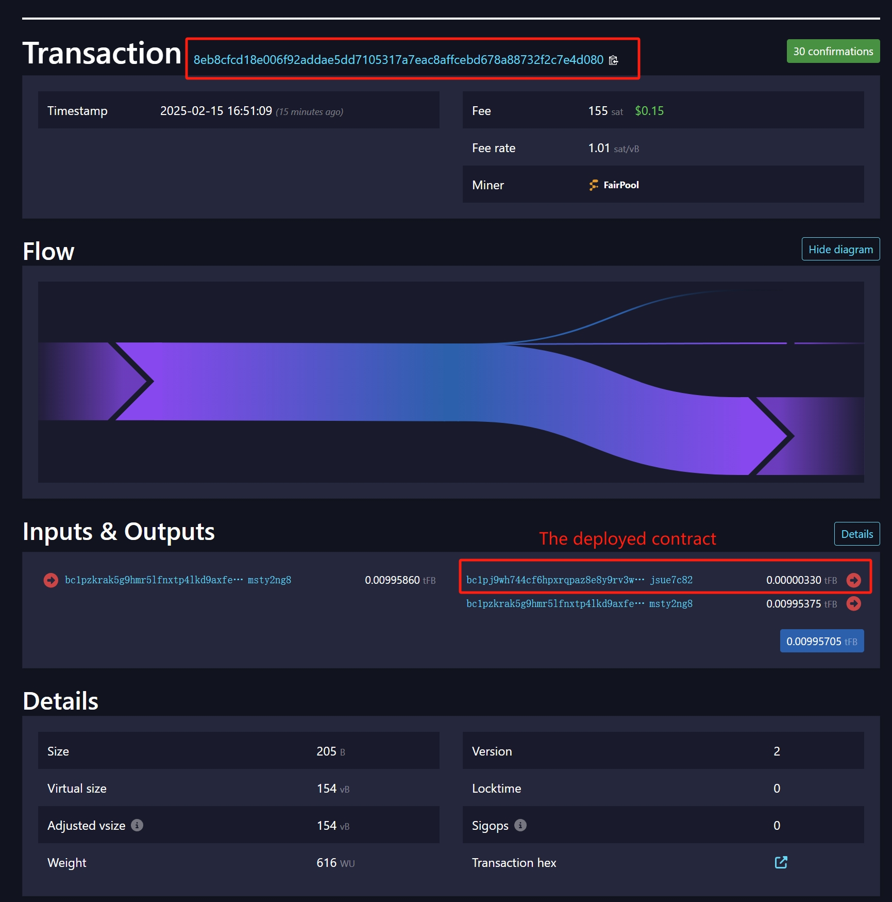
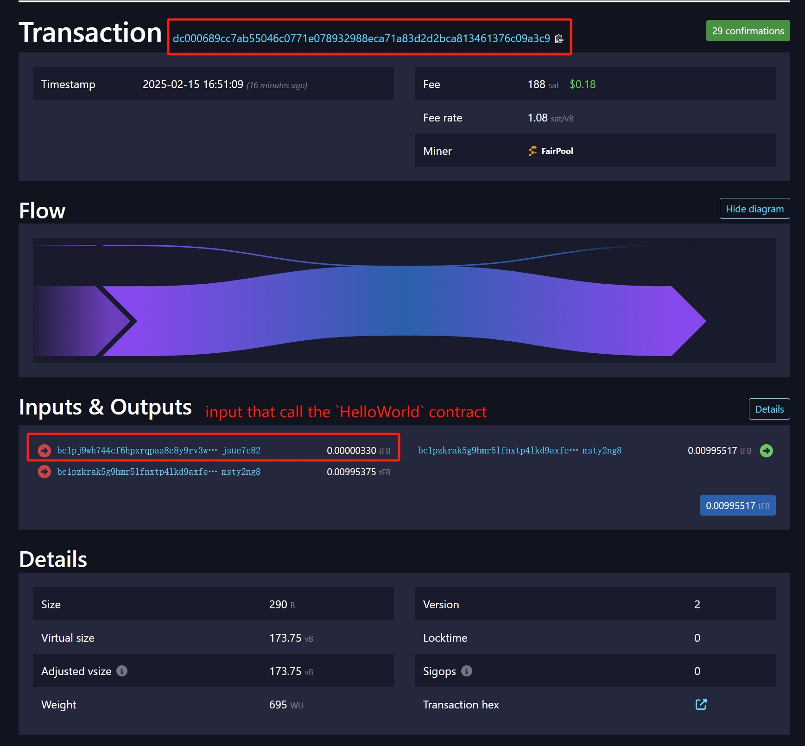

# Tutorial 1: Hello World


## Overview
In this tutorial, we will cover how to create a "Hello World" smart contract, deploy it, and call it.

Before starting, ensure all [prerequisite tools](../installation) are installed.

## Create a new project

Run the following commands to create a new project:

```sh
npx @scrypt-inc/cli-btc project helloworld
cd helloworld
npm install
```

The resulting project will contain a sample smart contract `/src/contracts/helloworld.ts`, along with all the scaffolding.

For this example, let's modify it to the following code:


```ts
import {
    assert,
    ByteString,
    method,
    prop,
    sha256,
    Sha256,
    SmartContract,
} from '@scrypt-inc/scrypt-ts-btc'

export class Helloworld extends SmartContract {
    @prop()
    hash: Sha256

    constructor(hash: Sha256) {
        super(...arguments)
        this.hash = hash
    }

    @method()
    public unlock(message: ByteString) {
        assert(sha256(message) == this.hash, 'Hash does not match')
    }
}
```

This `Helloworld` contract stores the sha256 hash of a message in the contract property `hash`. Only a message which hashes to the value set in `this.hash` will unlock the contract.

Now let’s look at what is in the smart contract.

- `SmartContract`: all smart contracts must extend the `SmartContract` base class.
- `@prop`:  the [`@prop` decorator](../how-to-write-a-contract/basics#properties) marks a contract property.
- `@method`: the [`@method` decorator](../how-to-write-a-contract/basics#method-decorator) marks a contract method. A [public method](../how-to-write-a-contract/basics#public-methods) is an entry point to a contract.
- `assert`: throws an error and makes the method call fail if its first argument is `false`. Here it ensures the passed message hashed to the expected digest.

## Compile Contract

1. Run following command to compile the `Helloworld` contract:

```sh
npx @scrypt-inc/cli-btc compile
```

This command will generate a contract artifact file at `/artifacts/helloworld.json`.

2. Then call the `loadArtifact()` function in the code:


```ts
import artifact from '../artifacts/contracts/helloworld.json'
Helloworld.loadArtifact(artifact)
```

## Compile using the `watch` option

Monitoring for Real-time Error Detection

```sh
npx @scrypt-inc/cli-btc compile --watch
```

The `watch` option in the provided command continuously monitors errors during the sCrypt compilation process.
Watch mode enables users to observe real-time updates and notifications regarding any errors specific to sCrypt, which are distinct from TypeScript errors.


## Contract Deployment & Call

Before we deploy the contract, you need to generate a Bitcoin key.

```bash
npm run genprivkey
```

then follow the [faucet instructions](../../how-to-deploy-and-call-a-contract/faucet) to fund the key.

Next, start deploying and calling the contract:

1. To [deploy a smart contract](../how-to-deploy-and-call-a-contract/how-to-deploy-and-call-a-contract.md#contract-deployment), simply call its `deploy` method.
1. To [call a smart contract](../how-to-deploy-and-call-a-contract/how-to-deploy-and-call-a-contract.md#contract-call), call one of its public methods.

For this example, overwrite `deploy.ts` in the root of the project with the following code to deploy and call the `Helloworld` contract:

```ts
import { Helloworld } from 'helloworld'
import { getDefaultProvider, getDefaultSigner } from './tests/utils/txHelper';
import { call, Covenant, deploy, sha256, toByteString } from '@scrypt-inc/scrypt-ts-btc';

(async () => {

    const covenant = Covenant.createCovenant(new Helloworld(sha256(toByteString("hello world", true))))

    const provider = getDefaultProvider();
    const signer = getDefaultSigner();


    const deployTx = await deploy(signer, provider, covenant);

    console.log(`Helloworld contract deployed: ${deployTx.getId()}`)

    const callTx = await call(signer, provider, covenant, {
        invokeMethod: (contract: Helloworld) => {
            contract.unlock(toByteString('hello world', true));
        },
    });

    console.log('Helloworld contract `unlock` called: ', callTx.getId())
})()
```

Run the following command to deploy AND call our example contract.

```
npx tsx deploy.ts
```

You will see some output like:




You can view [the deployment transaction](https://mempool-testnet.fractalbitcoin.io/tx/8eb8cfcd18e006f92addae5dd7105317a7eac8affcebd678a88732f2c7e4d080) using the WhatsOnChain blockchain explorer:




You can also view [the calling transaction](https://mempool-testnet.fractalbitcoin.io/tx/dc000689cc7ab55046c0771e078932988eca71a83d2d2bca813461376c09a3c9):



Congrats! You have deployed and called your first Bitcoin smart contract.
