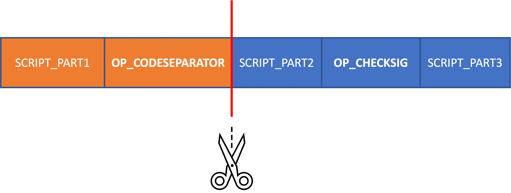

# Using Code Separators

Smart contract instances include the method `insertCodeSeparator(): void`. This method's role is to delineate the code segment of the smart contract, also known as the locking script, which will subsequently be signed and utilized during the execution of signature verification (`this.checkSig`). 

In the absence of a call to `insertCodeSeparator`, invoking `this.checkSig` will trigger the signature verification process over the entire body of the smart contract code. For a comprehensive understanding of the signature verification mechanism in Bitcoin, please read [the section below](#how-checksig-works).

However, the smart contract code's structure changes when it encompasses a call to `this.insertCodeSeparator`. In such cases, the code is partitioned before the verification stage. The resulting fragment, starting from and including the most recent `this.insertCodeSeparator` call before the call to `checkSig`, is the only segment used in the verification.

Under the hood, the method  will insert an [`OP_CODESEPARATOR`](https://wiki.bitcoinsv.io/index.php/OP_CODESEPARATOR) at the place, where it is invoked.

```ts
export class CodeSeparator extends SmartContract {

    @prop()
    readonly addresses: FixedArray<PubKeyHash, 3>;

    constructor(addresses: FixedArray<PubKeyHash, 3>) {
        super(...arguments);
        this.addresses = addresses;
    }

    @method()
    public unlock(sigs: FixedArray<Sig, 3>, pubKeys: FixedArray<PubKey, 3>) {
        assert(hash160(pubKeys[0]) == this.addresses[0]);
        this.insertCodeSeparator()
        assert(this.checkSig(sigs[0], pubKeys[0]));

        this.insertCodeSeparator()
        assert(hash160(pubKeys[1]) == this.addresses[1]);
        assert(this.checkSig(sigs[1], pubKeys[1]));

        this.insertCodeSeparator()
        assert(hash160(pubKeys[2]) == this.addresses[2]);
        assert(this.checkSig(sigs[2], pubKeys[2]));
    }

}
```

In the above example, the `unlock` method calls `insertCodeSeparator`. This implies that each invocation of `checkSig` will use the code below the most recent invocation of `insertCodeSeparator` within the signature verification process. This includes the invocation of `insertCodeSeparator` itself.

Therefore, this functionality requires us to modify the script when creating a signature. This is so that the signature signs only the necessary subscript, instead of the entire locking script. 
We can achieve this by passing the index of `insertCodeSeparator` as a method call parameter. This index will indicate at which occurrence of the `insertCodeSeparator` call to split the code at upon signing.
Let's take a look at an example method call for the smart contract above:

```ts
// Create array of signature options, each for a separate public key.
const pubKeyOrAddrToSign: SignaturesOption = []
for (let i = 0; i < publicKeys.length; i++) {
    const pubKey = publicKeys[i]
    pubKeyOrAddrToSign.push({
        pubKeyOrAddr: pubKey, // The public key for which a signature will be created.
        csIdx: i              // Index of the `insertCodeSeparator` call.
                              // I.e., if csIdx = 1, then only the code starting from and including
                              // the second occurence of `insertCodeSeparator` will be signed.
    })
}
const { tx: callTx, atInputIndex } = await demo.methods.unlock(
    (sigResps) => {
      // Inside the signature responses we can observe,
      // which instance of the `insertCodeSeparator` the signature
      // takes into account:
      console.log(sigResps)
      return findSigs(sigResps, publicKeys)
    },
    publicKeys.map((publicKey) => PubKey(toHex(publicKey))) as FixedArray<PubKey, 3>,
    {
        fromUTXO: dummyUTXO,
        pubKeyOrAddrToSign
    } as MethodCallOptions<CodeSeparator>
)
let result = callTx.verifyScript(atInputIndex)
```


## How `checkSig` Works

During execution of a call to a smart contracts method, upon a call to `checkSig`, the following procedure is applied:

1. A signature and a public key get passed as parameters to `checkSig`. The signature format is `<DER signature> <1 byte hash-type>`. Hashtype value is the last byte of the sig.
2. A new sub-script is created from the whole locking script (i.e. the smart contract itself). The script from the immediately after the most recently parsed call of `insertCodeSeparator` (`OP_CODESEPARATOR`) to the end of the script is the sub-script. If there is no OP_CODESEPARATOR the entire script becomes the sub-script.
3. Any occurrences of `OP_CODESEPARATOR` are deleted from the sub-script, if present.
4. A serialisation algorithm is used to produce a `SigHashPreimage`, which includes data from the current transaction, plus some parts from the previous transaction, such as the sub-script, mentioned above. The content of this `SigHashPreimage` depends on the `sighash` flag being used. See the [sighash flags wiki page](https://wiki.bitcoinsv.io/index.php/SIGHASH_flags).
5. The `SigHashPreimage` from the step above will be fed to double SHA256 to produce the 32-byte message. This message is used to check the ECDSA signature, together with the public key and the signature, that were passed as parameters to `checkSig`. Note that the `secp256k1` elliptic curve is used for the verification with the given public key.



