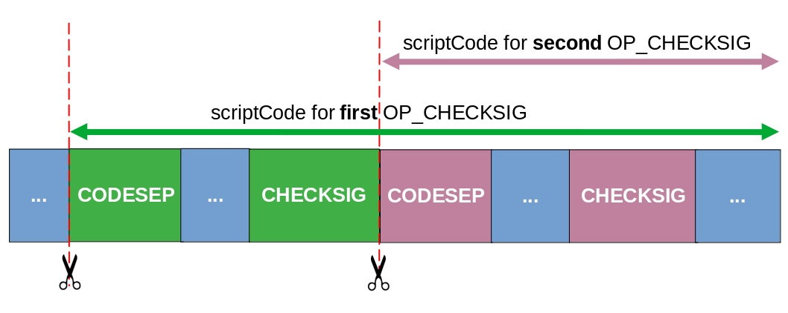

# Use Code Separators

## How Code Separators Work

In a Bitcoin signature, what is signed is [serialized ScriptContext](../how-to-write-a-contract/scriptcontext.md#serialization), whose format is as follows:


Part 5, `scriptCode`, usually contains the entire smart contract, i.e., locking script. The only exception is when there is [OP_CODESEPARATOR](https://wiki.bitcoinsv.io/index.php/OP_CODESEPARATOR) (OCS) in it. When the signature is being verified by [checkSig](../how-to-write-a-contract/built-ins.md#checksig), `scriptCode` is the locking script but removing everything up to and including the last executed OCS.


If multiple instances of `OP_CODESEPARATOR` are present, a subsequent `checkSig` will only use the part of the locking script after (and including) **the most recent** occurrence of `OP_CODESEPARATOR` as the `scriptCode`.




## How to Insert Code Separators

To insert an [`OP_CODESEPARATOR`](https://wiki.bitcoinsv.io/index.php/OP_CODESEPARATOR) in place, simply invoke [insertCodeSeparator()](../how-to-write-a-contract/built-ins.md#insertcodeseparator).

```ts
export class CodeSeparator extends SmartContract {

    @prop()
    readonly addresses: FixedArray<PubKeyHash, 3>;

    constructor(addresses: FixedArray<PubKeyHash, 3>) {
        super(...arguments);
        this.addresses = addresses;
    }

    @method()
    public unlock(sigs: FixedArray<Sig, 3>, pubKeys: FixedArray<PubKey, 3>) {
        assert(hash160(pubKeys[0]) == this.addresses[0]);
        this.insertCodeSeparator()
        assert(this.checkSig(sigs[0], pubKeys[0]));

        this.insertCodeSeparator()
        assert(hash160(pubKeys[1]) == this.addresses[1]);
        assert(this.checkSig(sigs[1], pubKeys[1]));

        this.insertCodeSeparator()
        assert(hash160(pubKeys[2]) == this.addresses[2]);
        assert(this.checkSig(sigs[2], pubKeys[2]));
    }

}
```

In the above example, the `unlock` method calls `insertCodeSeparator`. Each invocation of `checkSig` will use the code below the most recent invocation of `insertCodeSeparator` in the signature verification process. Multiple `OP_CODESEPARATOR`s can be inserted, each affecting the `checkSig` right after it.

### Generate a Signature
When `OP_CODESEPARATOR` is used, we need to change the way to get signatures.
This is because the signature so far signes the entire locking script, instead of a subscript with everything before OCS removed. 
We can achieve this by passing the index of `insertCodeSeparator` as a method call parameter, to specify which `OP_CODESEPARATOR` divides the locking script.
Let's take a look at an example for the smart contract above:

```ts
// Create array of signature options, each for a separate public key.
const pubKeyOrAddrToSign: SignaturesOption = []
for (let i = 0; i < publicKeys.length; i++) {
    const pubKey = publicKeys[i]
    pubKeyOrAddrToSign.push({
        pubKeyOrAddr: pubKey, // The public key for which a signature will be created.
        csIdx: i              // Index of the `insertCodeSeparator` call, starting from 0
                              // I.e., if csIdx = 1, then only the code starting from and including
                              // the second occurence of `insertCodeSeparator` will be signed.
    })
}
const { tx: callTx, atInputIndex } = await demo.methods.unlock(
    (sigResps) => {
      // Inside the signature responses we can observe,
      // which instance of the `insertCodeSeparator` the signature
      // takes into account:
      console.log(sigResps)
      return findSigs(sigResps, publicKeys)
    },
    publicKeys.map((publicKey) => PubKey(toHex(publicKey))) as FixedArray<PubKey, 3>,
    {
        fromUTXO: dummyUTXO,
        pubKeyOrAddrToSign
    } as MethodCallOptions<CodeSeparator>
)
let result = callTx.verifyScript(atInputIndex)
```


