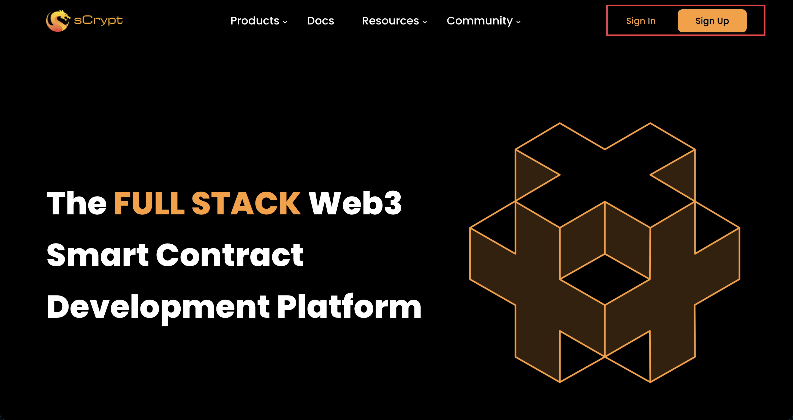
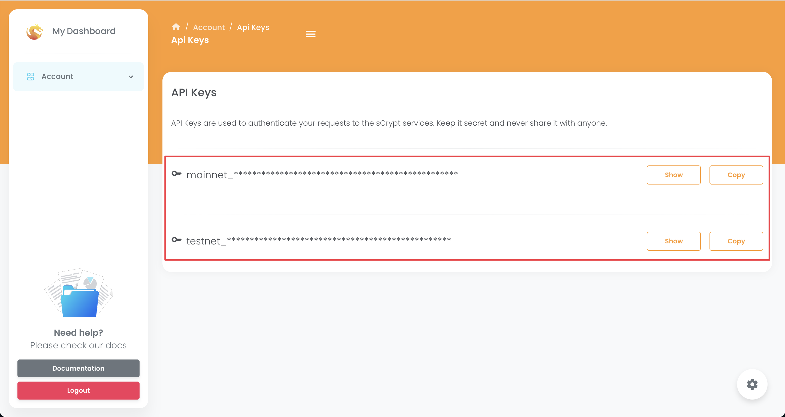

# How to Integrate sCrypt Service

Before interacting with a `sCrypt` contract, we must create a contract instance representing the latest state of the contract on chain. Such an instance can be created by calling the  [`fromTx`](../how-to-deploy-and-call-a-contract/how-to-deploy-and-call-a-contract.md#create-a-smart-contract-instance-from-a-transaction) method. However, this means your application needs to track and record all contract-related transactions, especially for a stateful contract.

An easier alternative is to leverage `sCrypt` infrastructure service, which tracks such transactions, so you can focus on your application logic.

## Get Your API Key

### Step 1: Create Your Free Account

Go to the [sCrypt homepage](https://scrypt.io) to create your free account.



### Step 2: Get API Key

Sign in and click on the copy icon to copy your API Key.



## Integration

Once you have an API key, you can easily integrate sCrypt service into your app by following these simple steps.

### Step 1: Initialize Client

You can pass the API key, along with `network`, to the `Scrypt.init` function to initialize an sCrypt client in your app.

```ts
import { Scrypt, bsv } from 'scrypt-ts'

Scrypt.init({
  apiKey: 'YOUR_API_KEY',
  network: bsv.Networks.testnet,
})
```

### Step 2: Connect `ScryptProvider` with your signer

Connect signer to `ScryptProvider`, the required [provider](../how-to-deploy-and-call-a-contract/how-to-deploy-and-call-a-contract.md#provider) to use sCrypt service.

```ts
const signer = new TestWallet(myPrivateKey)
await signer.connect(new ScryptProvider())
```

### Step 3: Get Contract ID

Each contract is uniquely identified by the transaction that [deploy](../how-to-deploy-and-call-a-contract/how-to-deploy-and-call-a-contract.md#contract-deployment) it and the output it is in, which we regard as its ID.

```ts
const counter = new Counter(0n)
// connect signer
await counter.connect(signer)

const balance = 1
const deployTx = await counter.deploy(balance)
console.log('contract Counter deployed: ', deployTx.id)

const contractId = {
    /** The deployment transaction id */
    txId: deployTx.id,
    /** The output index */
    outputIndex: 0,
}
```

You can usually get the ID of a contract from its creator, who publicizes it so others can interact with it.

### Step 4: Get Contract Instance

Once you have the contract ID, you can easily create a contract instance as follows.

```ts
const currentInstance = await Scrypt.contractApi.getLatestInstance(
  Counter,
  contractId
)

// connect signer
await currentInstance.connect(signer)
```
For a stateless contract, the instance points to the deployment tx; for a stateful one, it points to the latest tip in a chain of txs, which sCrypt service tracks automatically.

## Interact with the Contract
Once you have the instance after following the steps above, you can easily read from the contract, write to it, and listen to it.

### Read

You read an instance's properties using the dot operator, like any other object.

```ts
// read @prop count
console.log(counter.count)
```

:::note
Reading does NOT broadcast a transaction to the blockchain.
:::

### Write

To update a contract instance, you call its public method as [before](../how-to-deploy-and-call-a-contract/how-to-deploy-and-call-a-contract.md#contract-call), which writes to the blockchain by broadcasting a transaction.

```ts
// call the method of current instance to apply the updates on chain
const { tx } = await currentInstance.methods.incrementOnChain()

console.log(`Counter contract called,  tx: ${tx.id}`)
```

### Listen to Events

Often, your app needs to be notified when a contract gets called and updated. It is essential to be able to listen to such events in real time that can alert your app whenever something relevant occurs on chain. For example, in your front-end, you can refresh the web page to show the user the latest state of a contract, upon event notifications.

With the `sCrypt` service, you can easily subscribe to a contract's events by its contract ID, using ethier websockets or webhooks techniques depending on your requirements.

#### Websockets

Using websockets to listen contract events is such an easy job because we provide a dedicated API in our client SDK. Just using the `Scrypt.contractApi.subscribe` method. It takes two parameters:

1. `options: SubscribeOptions<T>`: it includes a contract class, a contract ID, and a optional list of method names monitored.

```ts
interface SubscribeOptions<T> {
  clazz: new (...args: any) => T;
  id: ContractId;
  methodNames?: Array<string>;
}
```

If `methodNames` is set, you will be notified only when public functions in the list are called. Otherwise, you will be notified when ANY public function is called.

2. `callback: (event: ContractCalledEvent<T>) => void`: a callback funciton upon receiving notifications.

`ContractCalledEvent<T>` contains relevant information on how the contract is called:

- `methodName: string`, which public method is called

- `args: SupportedParamType[]`, arguments the public method is called with

- `tx: bsv.Transaction`, transaction where contract is called from

- `nexts: Array[T]`, includes the new contract instances created by this call. If a stateful contract is called, `nexts` contains the contract instances containing the new state generated by this call. You can read the latest state from the new contract instance to, e.g., display the new state to users. If a stateless contract is called, `nexts` is empty.

Below is an example of listening to events when `incrementOnChain` method is called.

```ts
const subscription = Scrypt.contractApi.subscribe({
  clazz: Counter, // contract class
  id: contractId, // contract id
  methodNames: ['incrementOnChain']
}, (event: ContractCalledEvent<Counter>) => {
  // callback when receiving a notification
  console.log(`${event.methodName} is called with args: ${event.args}`)
});
```

Please note that by using this API, you do not need any backend services of your own; the code usually runs in your users browsers. But there might be a security issue because of the exposure of your API key to the public. So it’s highly recommended that you just use it in demo projects for trusted users.

#### Webhooks

There is another method for listening to contract events in a more secure and effective way. Just use our webhooks service to push event data to your own backend service.

#### Webhook Management

You need to create a valid webhook in our service before trying to receive any event data. You can find all webhook management features on the `webhooks` web page.


To create a valid webhook, you need to provide important information like this:

1. **Webhook URL**

This is the specified URL of your backend service for receving the associated event data.

2. **Network**

A webhook can only receive events from a single network. It must be either `testnet` or `mainnet`.

3. **Contract ID**

A webhook must listen to a certain contract ID, i.e., the deployment TX ID, and its output index. In other words, it will be notified only when this contract is called on the chain.

Please also note that the contract can be listened to only if it is deployed and called through our SDK or services.

4. **Contract Artifact**

A contract artifact is also needed for decoding the call data on the chain. You can usually find it in the `artifact` folder of your scrypt project. It's **required** if the contract ID was newly added to our service, and after that, it becomes optional. Also, you can only update those artifacts created by you.


#### Webhook Request and Response

When a contract is called on chain, we will push event data through an http POST request with a body like this to your webhook URLs:

```json
{
	"webhookId": "wh_EyY2zEnogmK9e57Q",
	"createdAt": "2023-07-24T04:00:32.246Z",
	"events": [{
		"eventType": "utxoSpent",
		"spentUtxo": {
			"txId": "966a3fb5d46c673ceaef2a476e828b75a6e6eae28839b36c0ff42cddc7a28f5b",
			"outputIndex": 0
		},
		"contractId": {
			"txId": "966a3fb5d46c673ceaef2a476e828b75a6e6eae28839b36c0ff42cddc7a28f5b",
			"outputIndex": 0
		},
		"spentBy": {
			"txId": "c359669cef68509d8357741e57bdff29f731c28643596d2c49f12dcd633e89f7",
			"inputIndex": 0
		},
		"createdInSpentTxOutputs": [
			0
		],
		"id": "evt_6XnqNUIhoZJ6SaEg5sDGcC",
		"methodName": "vote",
		"args": [{
			"name": "name",
			"type": "bytes",
			"value": "6950686f6e65"
		}]
	}]
}
```

Here we can explain more details about the `events` data in the request:

* `eventType`: The type name of the event. Currently only `utxoSpent` available.

* `spentUtxo`: The specified utxo of the contract been spent in the event.

* `contractId`: The contract ID of the event belongs to.

* `spentBy`: The specified input index of the contract call tx from which the event comes.

* `createdInSpentTxOutputs`: Newly generated contract utxo(s) in the spent tx if it's stateful contract.

* `id`: Unique event Id.

* `methodName`: The method name of the contract call of the event.

* `args`: The arguments list the contract call of the event.

You need to return an HTTP code of 200 for a successful acknowledgement. We will auto-pause the webhook after several unsuccessful deliveries. You need to manually reactivate it on the `webhooks` web page before we start pushing notifications to it again. Another important thing is that for a single event, there might be more than one notification pushed to the webhook, so make sure you have this situation handled.

#### Webhook Security

To keep your webhook requests secure, we add a signature header `x-scrypt-signature` for each request by signing the request data with your own API key using the HMAC-SHA256` algorithm. So you can verify it if you like. It's generated using code like this:

```
const signature = crypto.createHmac('sha256', apiKey).update(JSON.stringify(body)).digest('hex');
```
