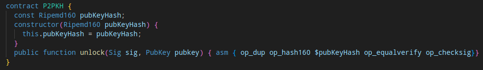

# How To Override Methods Compiled Code

In some rare cases you might want to use low level Bitcoin script to write a smart contracts method. This is usually done for optimization of the scrip size.
To achieve this currently, you have to edit the transpiled `.scrypt` files under your projects artifacts directory.

To make this easy and automated we have written a script that does this for you. 

Suppose you have an sCrypt project with the file `src/contracts/p2pkh.ts`, which contains a regular P2PKH smart contract:

```ts
import {
    assert,
    hash160,
    method,
    prop,
    PubKey,
    PubKeyHash,
    Sig,
    SmartContract,
} from 'scrypt-ts'

export class P2PKH extends SmartContract {
    @prop()
    readonly pubKeyHash: PubKeyHash

    constructor(pubKeyHash: PubKeyHash) {
        super(...arguments)
        this.pubKeyHash = pubKeyHash
    }

    @method()
    public unlock(sig: Sig, pubkey: PubKey) {
        assert(
            hash160(pubkey) == this.pubKeyHash,
            'public key hashes are not equal'
        )
        assert(this.checkSig(sig, pubkey), 'signature check failed')
    }
}
```

For some reason you are not happy with the default bitcoin script produced by the sCrypt compiler and would like to substitute the `unlock` functions script with something your wrote manually.

Let's create a directory named `optimizations` in the root of the project and clone the download the needed substitution script inside it:

```ts
mkdir optimizations
cd optimizations && wget wget https://raw.githubusercontent.com/sCrypt-Inc/scrypt-ts-lib/master/optimizations/apply_asm.js
```

Now, inside the `optimizations` directory, we also create a file named `asm.json`. Inside of it we define the substitutions we want to perform:

```json
{
  "files": [
    {
      "path": "artifacts/src/contracts/p2pkh.scrypt",
      "substitutions": [
        {
          "function": "unlock",
          "asm": "OP_DUP OP_HASH160 OP_3 OP_PICK OP_EQUALVERIFY OP_CHECKSIG"
        }
      ]
    }
  ]
}
```

We can observe, that the file declares a single substitution for the `unlock` method. Under the `asm` key is the actual script, encoded in ASM format. We can define multiple substations for multiple files if we would like to.

Now we have everything to automatically execute the ASM substitution. We can execute it manually like so:

```sh
node optimizations/apply_asm.js
```

After execution the intermediary `.scrypt` file of our smart contract will look like this:




Because it is crucial to run `apply_asm.js` after each project build. To make this process more convenient, we can modify the build script in `package.json`:

```json
"scripts": {
    "build": "tsc && npm run apply-optim",
    "apply-optim": "node optimizations/apply_asm.js",
    ...
```

Now, the script optimizations will be applied after every single build.

:::note
Please bear in mind that modifying the contract's script code may cause inconsistencies between the on-chain and local execution (methods TS code) behavior. Once you modify the Bitcoin script, it is your responsibility to keep the two versions functionally equivalent.
:::