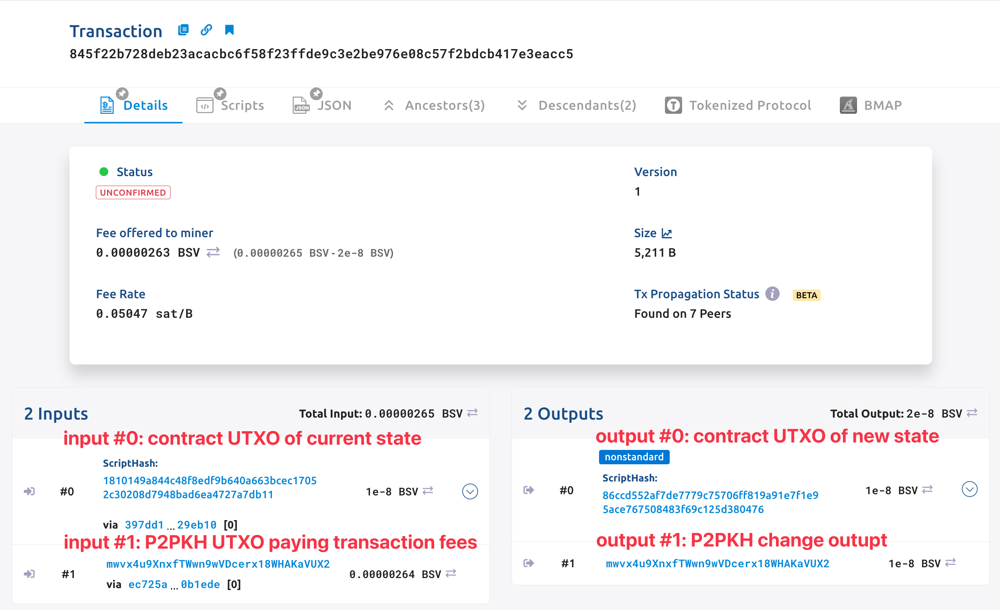

# Sighash Types

A signature hash (sighash) flag is used to indicate which part of the transaction is signed by the ECDSA signature. There are mainly two ways to use it in the context of Bitcoin smart contracts.

## 1. Sighash Types in Signatures

In this section, we will go deep into the sighash type and introduce how to use it in the bitcoin signatures.


### Digital Signature

A digital signature is a mathematical scheme that consists of two parts：

- an algorithm for creating a signature, using a private key to sign a message.

```
sign(privateKey, message) --> signature
```

- an algorithm that allows anyone to verify the signature, given also the message and a public key.

```
verify(signature, publicKey, message) --> true/false
```

The private key and the public key always appear in pairs, and the public key can be calculated from the private key, but not vice versa. Thus, you will always publish the public key so anyone can verify your signature, and keep the private key safe so only you can provide the correct signature.


Digital signatures are used to represent the authenticity and integrity of a message, since any modification to the message invalidates the signature, causing signature verification to fail. It is also proof that someone owns the private key, since the signature cannot be forged and it can be successfully verified with the corresponding public key only if it is signed with the correct private key.

### Bitcoin Signature

Digital signatures are applied to messages, which in the case of bitcoin, are the transactions themselves. The signature implies a commitment by the signer to specific transaction data. In the simplest form, the signature applies to the entire transaction (excluding the unlocking scripts), thereby committing all the inputs, outputs, and other transaction fields. The P2PKH transaction is a simple example of using signatures, which is widely used in bitcoin.

Using a sighash flag, a Bitcoin signature specifies which parts of a transaction’s data is included and thus signed by a private key. The included transaction data is the so called [ScriptContext](../how-to-write-a-contract/scriptcontext.md). Every signature has a sighash flag and the flag can be different from signature to signature. 

The image below illustrates what data would be signed using an `ALL` sighash flag. The data being signed is highlighted in green.


There are three sighash flags: `ALL`, `NONE`, and `SINGLE`.

| Sighash flag | Description                                                  |
| ------------ | ------------------------------------------------------------ |
| ALL          | Signature applies to all inputs and outputs                  |
| NONE         | Signature applies to all inputs, none of the outputs         |
| SINGLE       | Signature applies to all inputs but only the one output with the same index number as the signed input |

In addition, there is a modifier flag `ANYONECANPAY`, which can be combined with each of the preceding flags. When `ANYONECANPAY` is set, only one input is signed, leaving the rest inputs open for modification.

| Sighash flag         | Description                                                  |
| -------------------- | ------------------------------------------------------------ |
| ALL \| ANYONECANPAY    | Signature applies to one input and all outputs               |
| NONE \| ANYONECANPAY   | Signature applies to one input, none of the outputs          |
| SINGLE \| ANYONECANPAY | Signature applies to one input and the output with the same index number |

All the six flags can be summarized in the following diagram.


As described in the [doc](../how-to-write-a-contract/scriptcontext.md#sighash-type) before, different sighash type decides which part of the spending transaction is included in `ScriptContext`. More specifically, it will affect the value of four fields: `hashPrevouts`, `hashSequence`, `hashOutputs`, and `sigHashType`.

| Field        | Description                                                  |
| ------------ | ------------------------------------------------------------ |
| hashPrevouts | If the `ANYONECANPAY` modifier is not set, it's double SHA256 of the serialization of all input outpoints. Otherwise, it's a `uint256` of `0x0000......0000`. |
| hashSequence | If none of the `ANYONECANPAY`, `SINGLE`, `NONE` is set, it's double SHA256 of the serialization of sequence of all inputs. Otherwise, it's a `uint256` of `0x0000......0000`. |
| hashOutputs  | If the sighash type is neither `SINGLE` nor `NONE`, it's double SHA256 of the serialization of all outputs. If the sighash type is `SINGLE` and the input index is smaller than the number of outputs, it's the double SHA256 of the output with the same index as the input. Otherwise, it's a `uint256` of `0x0000......0000`. |
| sigHashType  | sighash type of the signature                                |

### Use Cases

For a transaction signed with the default sighash `ALL`, it cannot be modified in any way. This is because the signature commits to all inputs and outputs of the transaction, if any part changes, the signature and thus the transactio becomes invalid. This is desirable in most cases, because the sender does not want others to temper with the signed transaction.

Let’s look at some examples using non-default sighash types.

#### Crowdfunding

Someone attempting to raise funds can construct a transaction with a single output. The single output pays a target amount to a fundraiser. Such a transaction is obviously invalid, as it has no inputs. Others can amend it by adding an input of their own, as a donation. They sign their own input with `ALL|ANYONECANPAY` and pass the partially signed transactions to the next donor. `ALL` ensures the output and thus the target and fundraiser cannot be modified. `ANYONECANPAY` ensures anyone can pay by adding new inputs without invalidating existing donors' signatures. Each donation is a "pledge" which cannot be collected by the fundraiser until the entire target amount is raised.

#### Blank Check

Someone attempting to write a blank check can construct a transaction with several inputs and no output, and sign all the inputs with `NONE`. The signatures only commit to inputs of the transaction. This allows anyone to add their desired outputs to the transaction to spend the funds in anyway she wants.

### How to generate a signature with a specific sighash

For those contract public methods that require one or more signatures as input parameters, we can specify different sighash types for the signatures when calling it.

Take the [P2PKH contract](../how-to-deploy-and-call-a-contract/how-to-deploy-and-call-a-contract.md#method-with-signatures) as an example, it requires a single signature to `unlock`.

```ts
@method()
public unlock(sig: Sig, pubkey: PubKey) {
    // Check if the passed public key belongs to the specified address.
    assert(pubKey2Addr(pubkey) == this.address, 'public key does not correspond to address')
    // Check signature validity.
    assert(this.checkSig(sig, pubkey), 'signature check failed')
}
```

There are two changes to specify a sighash type, which defaults to `ALL` if not specified explicitly.

1. Pass a `SignatureOption` object to `pubKeyOrAddrToSign` to specify the sighash type.
2. Pass the sighash as the third parameter of `findSig()`.

Let's examine a usage example. Suppose we have the aforementioned `P2PKH` contract deployed, and we wish to call or unlock it. 
However, we encounter an issue: we don't possess sufficient funds to cover the network fees for the new contract call transaction. Fortunately, a generous friend offers to cover these fees for us. 
In this scenario, we can employ the `ANYONECANPAY | ALL` flag with our signature to unlock the deployed `P2PKH` contract. This allows our friend to append another input to our transaction, contributing funds to pay the network fee.

To illustrate, we would structure the contract call as follows:
```ts
const sighashType = SignatureHashType.ANYONECANPAY_ALL
const { tx } = await p2pkh.methods.unlock(
    // Pass the first parameter, the signature, to `unlock`.
    // Once the transaction is signed, signatures are returned in `SignatureResponse[]`.
    // Identify the required signature(s) using the public key, address, and the sighash type specified.
    (sigResps) => findSig(sigResps, publicKey, sighashType), 
    PubKey(toHex(publicKey)),
    {
        // Direct the signer to use the private key associated with `publicKey` and the specified sighash type to sign this transaction.
        pubKeyOrAddrToSign: {
            pubKeyOrAddr: publicKey,
            sigHashType: sighashType,
        },
        // This flag ensures the call tx is only created locally and not broadcasted.
        partiallySigned: true,
        // Prevents automatic addition of fee inputs.
        autoPayFee: false,
    } as MethodCallOptions<P2PKH>
)
```

Executing the above will yield the entire contract call transaction without broadcasting it. We can subsequently pass this transaction to our friend. Since we applied the `ANYONECANPAY` sighash flag, adding an additional input will not invalidate our signature. This is because network nodes will exclusively use the first input to authenticate our signature.

To further elaborate, we might also use the `ANYONECANPAY | SINGLE` flag. This would grant our friend the capability to append extra outputs to our transaction. This can be advantageous, for instance, if he wishes to reclaim a portion of his contributed funds as change, especially if he used an UTXO with an excessive amount of locked-in funds.

You can find a full code example in our project [boilerplate](https://github.com/sCrypt-Inc/boilerplate/blob/master/tests/p2pkh-anyonecanpay.test.ts).

## 2. Sighash Types in `@method()` Parameters

In this section, we will introduce how to specify different sighash types in the `@method()` decorator.

:::note
Sighash here only affects contracts that access `ScriptContext` in their public methods.
:::note

### Counter

Let us use the [Counter](../how-to-write-a-contract/stateful-contract.md) contract as an example. It simply records how many times it has been called since deployment.

Noted that the `@method` [decorator](../how-to-write-a-contract/basics#method-decorator) takes a sighash type as a parameter, whose default is `ALL`. According to the [doc](../how-to-write-a-contract/scriptcontext.md#sighash-type),  `hashOutputs` is the double SHA256 of the serialization of **all outputs** when the sighash type is `ALL`. The [default calling transaction builder](../how-to-deploy-and-call-a-contract/how-to-customize-a-contract-tx.md#default-1) adds a change output when necessary. That's why we need to add a change output when building outputs of the spending transaction in the public method: we need to build all the outputs that are included in `hashOutputs`. Otherwise, contract call will fail.

The following [transaction](https://test.whatsonchain.com/tx/845f22b728deb23acacbc6f58f23ffde9c3e2be976e08c57f2bdcb417e3eacc5) is a contract calling transaction of `Counter`. As you can see, it contains two outputs: one for the new state, the other for change.



### Advanced Counter

Noted that in the state transition of `Counter`, there is always only one UTXO that contains the latest contract state. When the contract is called, it spends the UTXO of the current state and creates a UTXO of the new state. Moreover, the contract input index of the spending transaction and the contract output index are the same.

In fact, we only care about the contract-related UTXO in the transaction inputs and outputs when calling Counter, and do not care about other inputs and outputs. Thus, we can use `SINGLE | ANYONECANPAY` to simplify the contract.
`SINGLE` lets us focus on the contract output itself.
`ANYONECANPAY` allows anyone to add inputs for this contract calling transaction to, e.g., pay fees.


We make two changes to the original Counter.

1. Using `@method(SigHash.ANYONECANPAY_SINGLE)`
2. Build an `output` that only contains the contract's new state, without the change output.

```ts
export class AdvancedCounter extends SmartContract {
    ...
    
    // 1) add ANYONECANPAY_SINGLE
    @method(SigHash.ANYONECANPAY_SINGLE)
    public incrementOnChain() {
        ...
        
        const amount: bigint = this.ctx.utxo.value
        // 2) remove change output
        const output: ByteString = this.buildStateOutput(amount)
        assert(this.ctx.hashOutputs == hash256(output), 'hashOutputs mismatch')
    }
    
    ...
}
```

You can check the [complete code here](https://github.com/sCrypt-Inc/boilerplate/blob/master/src/contracts/advancedCounter.ts).

The following [transaction](https://test.whatsonchain.com/tx/e06d86f8d8b867c503eca799bb542b5f1d1f81aa75ad00ab4377d65764bef68c) is a contract calling transaction of `AdvancedCounter`. You can see it also contains two outputs, but we only use one output when checking if it hashes to `hashOutputs` in the public method, since we use `SINGLE`.


### More examples

Use different sighash types in `@method()` decorator will change the value of `ScriptContext`. This is useful in many cases.

- If your contract needs to restrict all inputs and outputs of the spending transaction, use `ALL`.
- If your contract is stateful and the state is always in a single output, simplify it using `SINGLE`.
- If you want to enable someone else could add inputs after the transaction is sealed, such as for paying transaction fees, apply the `ANYONECANPAY` modifier.

You can find these examples in our [boilerplate](https://github.com/sCrypt-Inc/boilerplate).

- [AnyoneCanSpend](https://github.com/sCrypt-Inc/boilerplate/blob/master/src/contracts/acs.ts)
- [Clone](https://github.com/sCrypt-Inc/boilerplate/blob/master/src/contracts/clone.ts)
- [ERC20](https://github.com/sCrypt-Inc/boilerplate/blob/master/src/contracts/erc20.ts)
- [ERC721](https://github.com/sCrypt-Inc/boilerplate/blob/master/src/contracts/erc721.ts)
- [OrdinalLock](https://github.com/sCrypt-Inc/boilerplate/blob/master/src/contracts/ordinalLock.ts)
