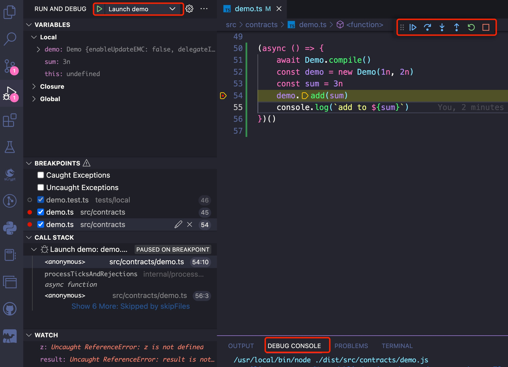

# How to Debug a Contract

Debugging an sCrypt contract is as easy as debugging TypeScript, since it is just TypeScript.


## Use `console.log()`

You can use `console.log()` to print to the console.


```ts
export class Demo extends SmartContract {

    @prop()
    readonly x: bigint

    @prop()
    readonly y: bigint

    constructor(x: bigint, y: bigint) {
        super(...arguments)
        this.x = x
        this.y = y
    }

    @method()
    sum(a: bigint, b: bigint): bigint {
        return a + b
    }

    @method()
    public add(z: bigint) {
        console.log(`z: ${z}`) // print the value of z
        console.log(`sum: ${this.x + this.y}`) // print the value of this.x + this.y
        assert(z == this.sum(this.x, this.y), 'incorrect sum')
    }
}
```
[Try it on Replit](https://replit.com/@msinkec/scryptTS-console-logging)

After running the code, you should see the following output:

```
z: 3
sum: 3
```


## Use Visual Studio Code debugger

You can use VS Code to debug sCrypt contracts, the same way as any other TypeScript programs. If you have created a project with [the sCrypt CLI](installation.md), you should have an auto-generated [launch.json](https://github.com/sCrypt-Inc/boilerplate/blob/master/.vscode/launch.json), containing everything needed for the debugger out of the box. To learn more about the VS Code TypeScript debugger, please refer to the [official documentation](https://code.visualstudio.com/docs/TypeScript/TypeScript-debugging).


You can set some breakpoints and choose `Launch demo` from the `Run and Debug` view (or press **F5**) to start the debugger instantly.


:::note
You need to change the contract file name in [launch.json](https://github.com/sCrypt-Inc/boilerplate/blob/master/.vscode/launch.json#L13) if needed.
:::

### Debug a test
If you want to debug a unit test written with the [Mocha](https://mochajs.org) testing framework, choose `Launch demo test` from the `Run and Debug` view.


:::note
You need to change the contract test file name in [launch.json](https://github.com/sCrypt-Inc/boilerplate/blob/master/.vscode/launch.json#L25) if needed.
:::