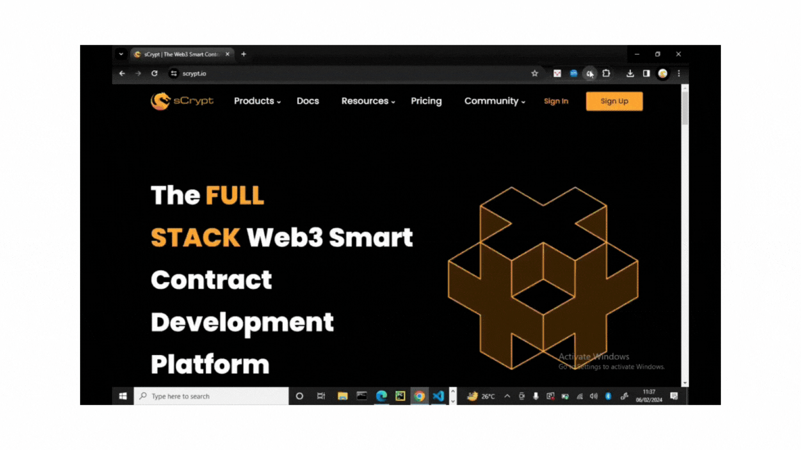

# Faucet

It is highly recommended to test your contract on the [testnet](https://test.whatsonchain.com/) after passing local tests. It ensures that a contract can be successfully deployed and invoked as expected on the blockchain.

Before deploy and call a contract, you need to have a funded address:


1. Create a new project. Skip this step if you have already created a project:

```sh
npx scrypt-cli project demo
cd demo
```

2. Generate a private key with the following command executed from the root of the project:

```sh
npm install
npm run genprivkey
```

The command will generate a private key and store it in a `.env` file in our project's root directory. It also outputs the [Bitcoin address](https://wiki.bitcoinsv.io/index.php/Bitcoin_address) corresponding to our private key.

3. Fund the private key's address with some testnet coins. You could use this [faucet](https://scrypt.io/faucet) to receive test coins.


### Use the Panda Wallet
If you have [Panda wallet](https://chromewebstore.google.com/detail/panda-wallet/mlbnicldlpdimbjdcncnklfempedeipj) installed, you can easily use the testnet private key as follows : 


### Use the Sensilet Wallet

Alternatively, if you have already installed [Sensilet](https://sensilet.com/), you can extract and use its private key on testnet as follows.


