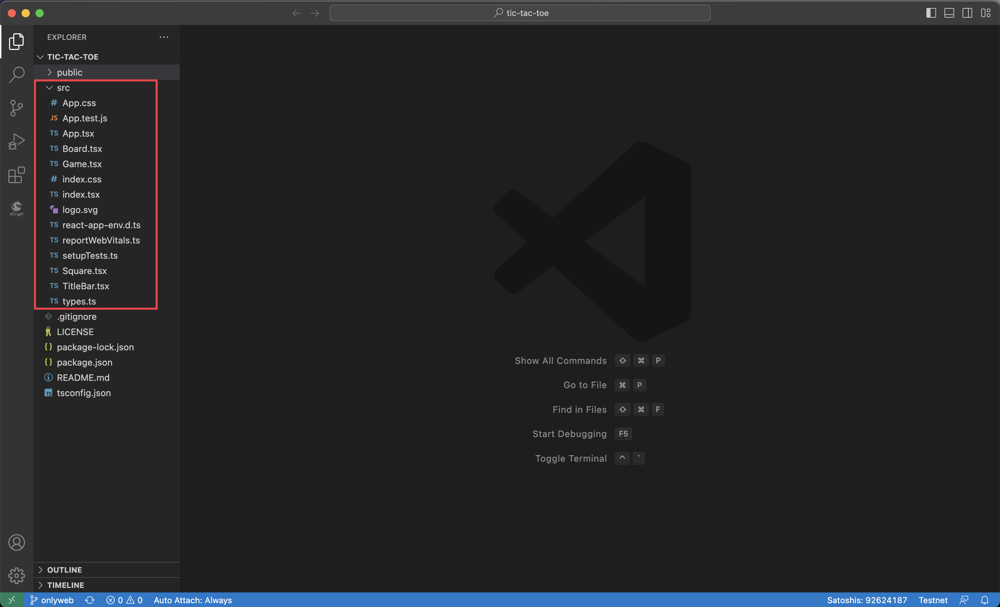
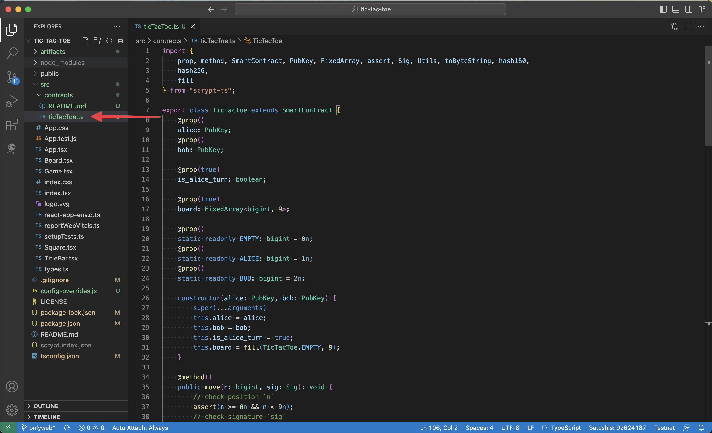
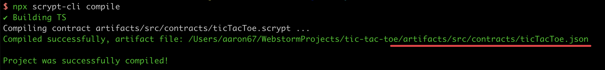
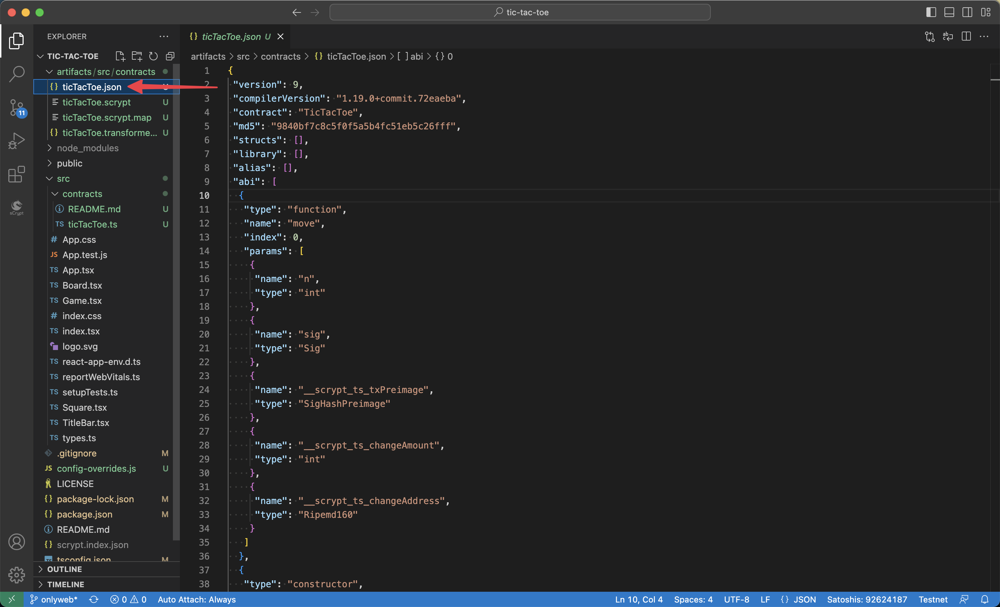
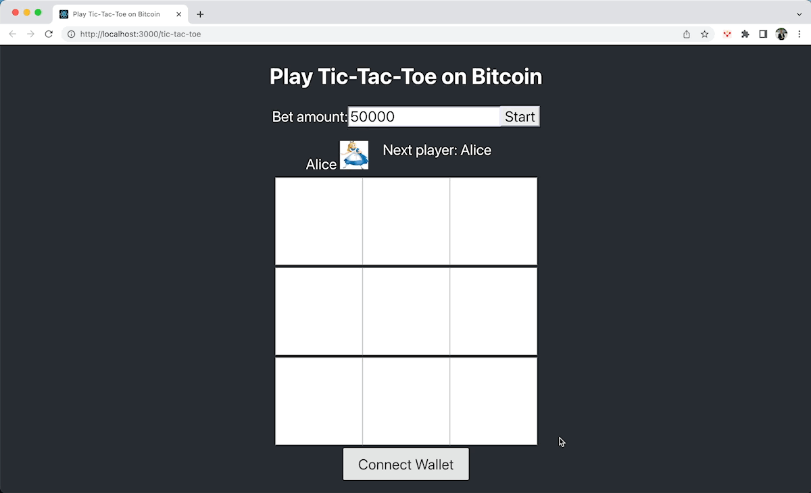
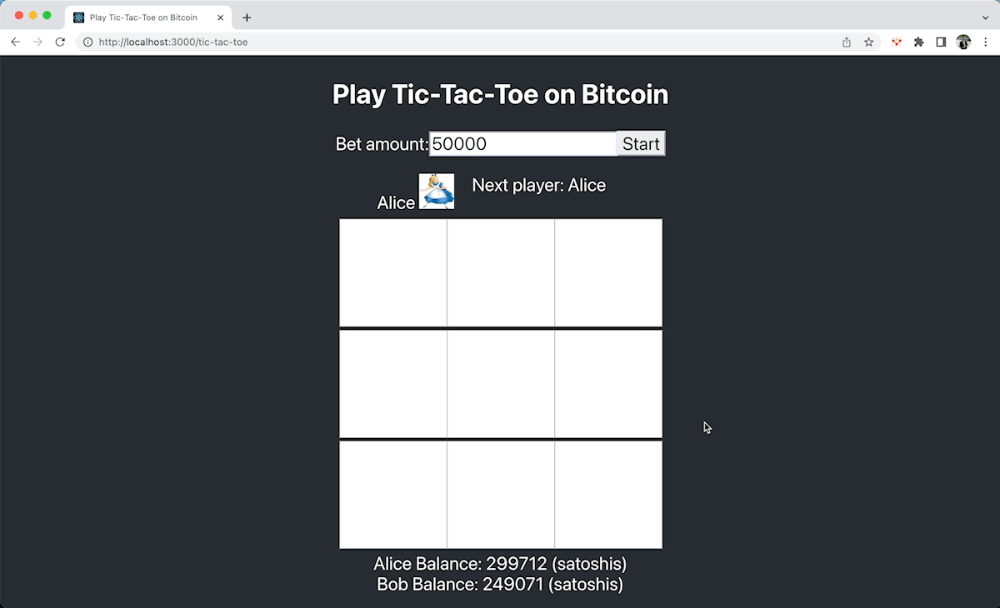

# How to integrate Smart Contract With a Frontend

In this part, we will create a full-stack decentralized application (dApp) by connecting the [Tic-Tac-Toe](./tutorials/tic-tac-toe.md) smart contract to a frontend project and interacting with it.

For this dApp, we will use [React](https://reactjs.org/) as our frontend framework. We assume that you already have the basic knowledge of frontend development, so we will not spend much time introducing this part of the code, but mostly be focusing on how to interact with the smart contract in the frontend project.

:::note
You can use any frontend framework to build the dApp.
:::

## Setup

### Scaffold

It's free to run the following command to create a React app from the very beginning.

```bash
npx create-react-app tic-tac-toe --template typescript
```

Or directly clone the [repository](https://github.com/sCrypt-Inc/tic-tac-toe) that we have created. The `onlyweb` branch of this repository only contains the frontend code.

```bash
git clone -b onlyweb https://github.com/sCrypt-Inc/tic-tac-toe
```


Later, we will do most work under the `src` directory.

### Install scryptTS SDK

The sCrypt SDK - [scryptTS](https://scrypt.io/scrypt-ts) - enables you to easily compile, test, deploy, and call contracts.

Step into the project directory, then use the `scrypt-cli` command line tool to install the SDK.

```bash
cd tic-tac-toe
npx scrypt-cli init
```

This `init` command will also install the dependencies and initialize the contract development environment.

After this initialization, we are ready to go!

## Load Contract

Before interacting with the contract in the front end, we need to load it first. 

When a contract source file is compiled, it will deliver a JSON file, we call it the contract artifact.

Generally, as a frontend developer, you will get this contract artifact from your backend partner or contract developer, then load it in the front end, and that's all.

We'll take a look at how to generate the artifact by ourselves first.

### Compile Contract

When you have the contract source file, copy it into `src/contracts` directory.



Then run the following command to compile the contract.

```bash
npx scrypt-cli compile
```



After the compilation, you will get the artifact in `artifacts/src/contract` directory.



### Load Artifact

Now with the artifact file `ticTacToe.json`, we directly load it in the `index.tsx` file.

```ts
import { TicTacToe } from './contracts/ticTacToe';
var artifact = require('../artifacts/src/contracts/ticTacToe.json');
TicTacToe.loadArtifact(artifact);
```

## Integrate Wallet

We will integrate [Sensilet](https://sensilet.com/), a MetaMask-like wallet, into our project.

### Signer and Provider

When a user wants to send a transaction onto the chain, our dApp would prompt the user to “sign” the transaction using their private key and be authorized to perform certain actions. The `Signer` interface is an abstraction of the entity controlling the private key. A simple signer would be a single private key, while a complex signer is a wallet.

A `Provider` is an abstraction for a Bitcoin node that you connect with when you need to interact with the blockchain, e.g., to broadcast a transaction. Whatsonchain is an example, providing access to the blockchain.

### Connect Sensilet Wallet

After clicking the **Connect Sensilet** button, we initialize a `SensiletSigner` and save it.

In the `App.tsx` file, we then call the `getDefaultPubKey()` interface of the wallet to request to connect to get the public keys of the two players.

```ts
const sensiletLogin = async () => {
    try {
      const provider = new DefaultProvider();
      const signer = new SensiletSigner(provider);

      signerRef.current = signer;
      
      setConnected(true);

      const alicPubkey = await signer.getDefaultPubKey();
      setAlicePubkey(toHex(alicPubkey))

      // Prompt user to switch accounts

    } catch (error) {
      console.error("sensiletLogin failed", error);
      alert("sensiletLogin failed")
    }
};
```

### Show Balance

After the connection is successful, we all the `getBalance()` interface to get the wallet balance:

```ts
signer.getBalance().then(balance => 
  // UTXOs belonging to transactions in the mempool are unconfirmed
  setAliceBalance(balance.confirmed + balance.unconfirmed)
);
```

If a wallet is connected, its balance is displayed. Otherwise, we show the connect button.

```ts
{
  isConnected ?
    <div>
      <label>Alice Balance: {alicebalance} <span> (satoshis)</span></label>
    </div>
    :
    <button
      className="pure-button button-large sensilet"
      onClick={sensiletLogin}
    >
      Connect Wallet
    </button>
}
```



## Initialize Contract

We have obtained the contract class `TicTacToe` by loading the contract artifact file. When the user clicks the start button, the contract is initialized with the public keys of two players `alice` and `bob`. The public key can be obtained through the `getDefaultPubKey()` interface of `Signer`.

```ts
const signer = signerRef.current as SensiletSigner;

const instance = new TicTacToe(
    PubKey(toHex(alicePubkey)),
    PubKey(toHex(bobPubkey))
);

await instance.connect(signer);
```

## Deploy Contract

Each contract instance has a `deploy` method:

```ts
async deploy(amount:number = 1, options?: { 
    changeAddress?: AddressOption,
    address?: AddressOption
}): Promise<TransactionResponse>;
```

- `amount`: how many satoshis would be locked in the contract when deployed.
- `options`: an optional parameter, `changeAddress` is a customed change address, and the corresponding private key of `address` will be used to sign the transaction.

You can visit the full complete code of [`App.tsx`](https://github.com/sCrypt-Inc/tic-tac-toe/blob/main/src/App.tsx) for more details.

## Call Contract

Now we can start playing the game. Every move is a call to the contract and triggers a change in the state of the contract. The interaction between the web application and the contract occurs at this stage.

Calling the contract requires the following steps:

- Create a new contract instance via the `.next()` method of the current instance. Update the state of the new instance to the latest.
- Add a transaction builder to the `move()` method of the `TicTacToe` contract through the `bindTxBuilder` method, which builds the calling transaction.
- Finally, call the `methods` public method on the contract instance to send the transaction to call the contract. Every public method `xxx` has a function of the same name under `contractInstance.methods.xxx`. It takes the same parameters, plus a `MethodCallOptions`.

If the public method has a signature parameter, a callback function is required to return the signature. The `Signer` connected to the contract will use the default private key to sign, and the signature will be returned through the parameter `sigResps` of the callback function. Use `findSig()` to find the signature associated with a public key.

Through `pubKeyOrAddrToSign` in `MethodCallOptions`, you can specify which address/public key to sign against.

```ts
const { tx: callTx } = await p2pkh.methods.unlock(
    (sigResponses: SignatureResponse[]) => findSig(sigResponses, $publickey),
    $publickey,
    {
        pubKeyOrAddrToSign: $publickey.toAddress()
    } as MethodCallOptions<P2PKH>
);
```

- After the call is completed, the new contract instance needs to be saved, to continue calling the contract later.

The code implementation of the above steps:

```ts
// 1. create nextInstance
const current = props.contract as TicTacToe;
const nextInstance = current.next();
// convert latest game data to contract state with Utils.toContractState and update nextInstance state
Object.assign(nextInstance, Utils.toContractState(latestGameData));

// 2. bind a tx builder for move
TicTacToe.bindTxBuilder('move', async (options: BuildMethodCallTxOptions<SmartContract>, n: bigint, sig: Sig) => {
    ...
}

// 3. call contract.methods.move(...) to broadcast transaction
const {tx, next} = await current.methods.move(
    BigInt(i),
    (sigResponses: SignatureResponse[]) => findSig(sigResponses, $publickey)
);

// 4. save latest contract instance
props.setContract(next?.instance)
```

So far, we have completed the interaction between the `TicTacToe` contract and the web frondend. Every move will prompt the player to sign and submit a transaction on the blockchain.



You can visit the full complete code of [`Game.tsx`](https://github.com/sCrypt-Inc/tic-tac-toe/blob/main/src/Game.tsx) for more details.

## Conclusion

Great, you made it to the end of this last part! Now you're fully equipped to apply the skills from this tutorial to build out your own custom dApp project!

The full complete code of this demo is at [Bitcoin on-chain App Tutorial](https://github.com/sCrypt-Inc/tic-tac-toe).
