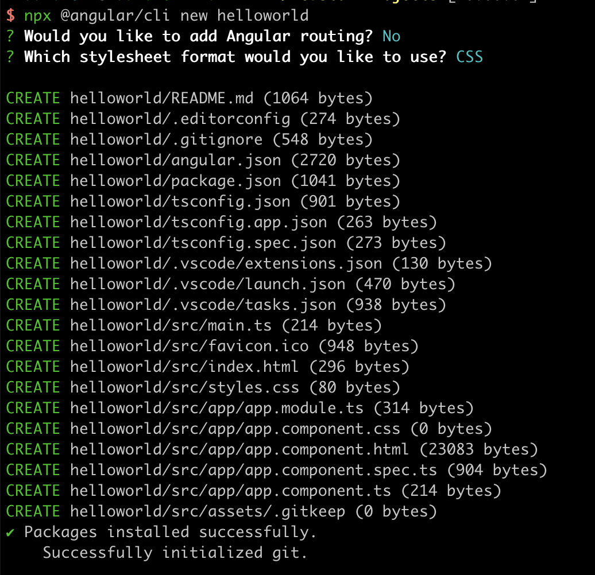
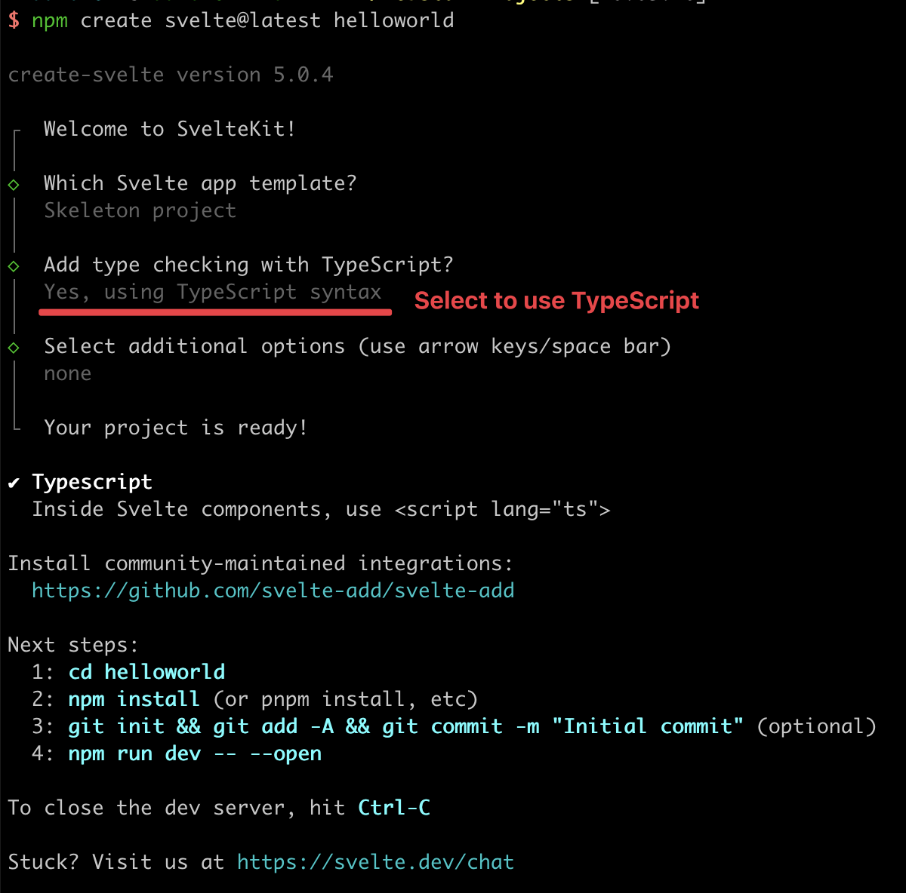

# How to integrate with a front-end

This section will show how to integrate your smart contract to a front-end, so users can interact with it.
We assume that you already have the basic knowledge of front-end development, so we will not spend much time introducing this part of the code, but mostly be focusing on how to interact with the smart contract in the front-end project.

## Create a project

Create your front-end project using React, Next, Vue, Angular, or Svelte.

### React

Run the following command to create a [React](https://react.dev/) project named `helloworld`.

```bash
npx create-react-app helloworld --template typescript
```


We will do most work under the `src` directory.

### Next.js

Run the following command to create a [Next.js](https://nextjs.org/) project.

```bash
npx create-next-app helloworld --typescript --use-npm
```


### Vue.js

#### Vite

Run the following command to create a [Vue](https://vuejs.org/) 3.x project bundled with [Vite](https://vitejs.dev/).

```bash
npm create vue@3
```


If you'd like to use Vue 2.x, run the following command to initialize the project scaffold.

```bash
npm create vue@2
```


#### Webpack

Run the following command to create a [Vue](https://vuejs.org/) project bundled with [Webpack](https://webpack.js.org/).

```bash
npx @vue/cli create helloworld
```

:::tip
Vue 3.x and 2.x bundled with Webpack are both supported.
:::

When setting up the project, select `Manually select features` and enable TypeScript.


### Angular

Run the following command to create an [Angular](https://angular.io/) project.

```bash
npx @angular/cli new helloworld
```



### Svelte

Run the following command to create a [Svelte](https://svelte.dev/) project.

```bash
npm create svelte@latest helloworld
```



:::note
Currently, we support front-end frameworks [React](https://react.dev), [Next.js](https://nextjs.org/), [Vue](https://vuejs.org/), [Angular](https://angular.io/), and [Svelte](https://svelte.dev/). We anticipate to add support for other frameworks over time.
:::

## Install the sCrypt CLI

Run the `init` command of the [CLI](../installation.md#the-scrypt-cli-tool) to add `sCrypt` support in your project.

```bash
cd helloworld
npx scrypt-cli init
```

This command installs the dependencies and configures the contract development environment.
After this, we are ready to go!

## Load the Contract

Before interacting with a smart contract at the front-end, we need to load the contract class in two steps.

We'll take a look at how to generate the artifact by ourselves first.

### 1. Compile Contract

Before you start, you need to get the contract source files, as a front-end developer.

Let's use the [Helloworld contract](../tutorials/hello-world.md) as an example. Copy and paste `helloworld.ts` into the `src/contracts` directory.


Run the following command to compile the contract.

```bash
npx scrypt-cli compile
```


After the compilation, you will get an JSON artifact file at `artifacts/helloworld.json`.


### 2. Load Artifact

Now with the contract artifact file, you directly load it in the `index.tsx` file.

```ts
import { Helloworld } from './contracts/helloworld';
import artifact from '../artifacts/helloworld.json';
Helloworld.loadArtifact(artifact);
```

Now you can create an instance from the contract class as before.
```ts
const message = toByteString('hello world', true)
const instance = new Helloworld(sha256(message))
```

:::info
You cannot simply call `Helloworld.compile()` at the front-end, since it only works in NodeJS, not in browser.
:::

## Integrate Wallet

You will integrate [Yours Wallet](https://chromewebstore.google.com/detail/panda-wallet/mlbnicldlpdimbjdcncnklfempedeipj), a wallet as a browser extension, similar to [MetaMask](https://metamask.io/), into the project.

:::info
You can refer to this [guide](../advanced/how-to-add-a-signer.md) to add support for other wallets.
:::

To request access to the wallet, you can use its `requestAuth` method.

```ts
const provider = new DefaultProvider({
    network: bsv.Networks.testnet
});

const signer = new PandaSigner(provider);

// request authentication
const { isAuthenticated, error } = await signer.requestAuth();
if (!isAuthenticated) {
    // something went wrong, throw an Error with `error` message
    throw new Error(error);
}

// authenticated
// you can show user's default address
const userAddress = await signer.getDefaultAddress();
// ...
```

Now you can connect the wallet to the contract instance as before.
```ts
await instance.connect(signer);
```

Afterwards, you can interact with the contract from the front-end by [calling its method](../how-to-deploy-and-call-a-contract/how-to-deploy-and-call-a-contract.md#contract-call) as usual.

[This repo](https://github.com/sCrypt-Inc/counter-demos) contains a counter example, integrated with all supported frameworks.

Go to the [sCrypt Academy](https://academy.scrypt.io) to see a step-by-step guide on how to build a Tic-Tac-Toe game on chain.
