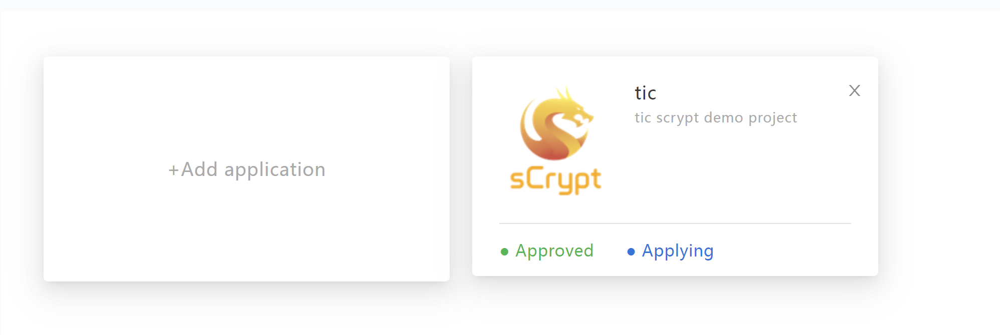
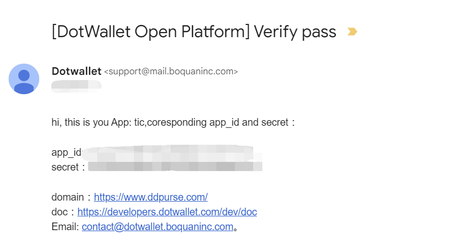
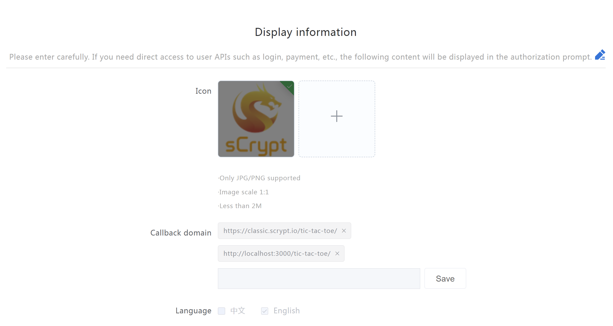
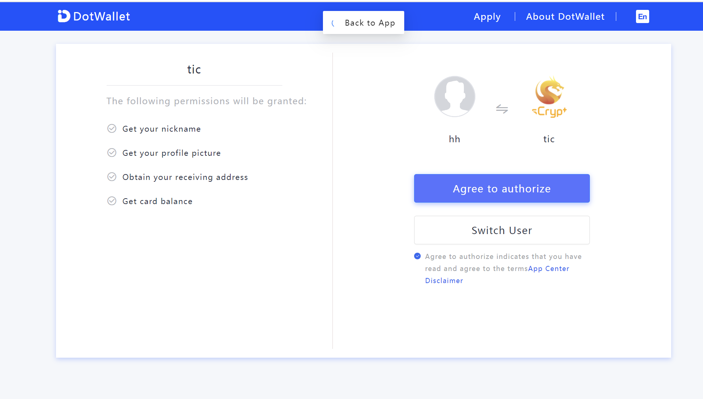

# How to integrating dotwallet


[DotWallet](https://www.dotwallet.com/en) is a lightweight wallet designed to help users easily and securely manage their digital assets. We will introduce how to integrate dotWallet.


## Oauth 2.0


DotWallet user authorization follows the standard authorization code flow of OAuth2. See [RFC6749](https://tools.ietf.org/html/rfc6749#section-4.1) for details. 


```
+----------+
| Resource |
|   Owner  |
|          |
+----------+
     ^
     |
    (B)
+----|-----+          Client Identifier      +---------------+
|         -+----(A)-- & Redirection URI ---->|               |
|  User-   |                                 | Authorization |
|  Agent  -+----(B)-- User authenticates --->|     Server    |
|          |                                 |               |
|         -+----(C)-- Authorization Code ---<|               |
+-|----|---+                                 +---------------+
  |    |                                         ^      v
 (A)  (C)                                        |      |
  |    |                                         |      |
  ^    v                                         |      |
+---------+                                      |      |
|         |>---(D)-- Authorization Code ---------'      |
|  Client |          & Redirection URI                  |
|         |                                             |
|         |<---(E)----- Access Token -------------------'
+---------+       (w/ Optional Refresh Token)
```

User authorization is based on Oauth2's Authorization Code grant. Authorization Code grant flow:

1. Construct URI. 

    Example URI: `https://api.ddpurse.com/v1/oauth2/authorize?client_id=YOUR-CLIENT-ID&redirect_uri=http%3A%2F%2FYOUR-REDIRECT-URL&response_type=code&state=YOUR-STATE&scope=user.info`

    URL Parameters:

    | Parameter    | Required | Description |
    | -------- | ------- | ------- |
    | client_id  | YES    | Developer’s dapp client_id    |
    | redirect_uri | YES     | The redirect URL after authorization. Needs to be url_encoded   |
    | state    | YES   | It is recommended to use a random string of more than 32 bits (such as UUID). The state is used to verify the consistency of the request and callback. This can prevent csrf attacks.  |
    |response_type |YES | Fill in the fixed value : `code` |
    |scope | YES | Authorization scope. The list of permissions that the user agrees to authorize. These permissions are required for certain API endpoints. Needs to be url_encoded. Use spaces to separate multiple permissions. For a list of currently supported scope permissions, please check the scope list below|

2. Redirect the user to the URI constructed in **1**
   
    After clicking the link, the user will be directed to the DotWallet authorization page. DotWallet will ask the user to log in, and then ask whether they agree to authorize the application for the listed permission scopes.

3. Receive the `code` through the callback uri.

    After the user agrees to authorization in **2**, DotWallet will redirect the client to the redirect_uri specified by the application. The authorization code code and the provided state will be included in the query parameters.

4. Exchange code for access_token. The access tokens are credentials used to access protected resources, which are issued by the authorization server.
   
:::warning
To avoid security issues, any request for using or obtaining `access_token` must be made from the backend server. Do not disclose your `client_id` and `client_secret` on the client side.
:::


## Dotwallet Developer Platform

1. Before using dotwallet, you need to register and create a dApp on [Dotwallet Developer Platform](https://developers.dotwallet.com/en).



2. After creating the dApp, you will receive an email containing `app_id` and `secret`.




3. Next, you need to set [redirection URI](https://www.oauth.com/oauth2-servers/redirect-uris). Redirect URLs are a critical part of the OAuth flow. After a user successfully authorizes an application, the authorization server will redirect the user back to the application. For example, in the figure below, we filled in two redirection URIs.
  
- [https://classic.scrypt.io/tic-tac-toe/](https://classic.scrypt.io/tic-tac-toe) is the address used for product deployment.
- [http:/ /localhost:3000/tic-tac-toe/](http://localhost:3000/tic-tac-toe/) is used for development and debugging.




:::note
*Callback domain* in the form is the redirection URIs in oauth. 
:::

## Development Environment 

sCrypt SDK provides `DotwalletSigner` for quick integration with dotwallet.

You can use `DotwalletDevOption` to create `DotwalletSigner`. Using `DotwalletDevOption` does not require to build a backend service. `DotwalletSigner` will automatically complete the authorization code grant flow for you on the front end.

:::note
`DotwalletDevOption` is only for development and debugging, otherwise it will leak your `client_secret` <sup>1</sup>. 
:::

```ts
/**
  * Please note that `DotwalletDevOption` is only used to create DotwalletSigner in development environment.
  * This Option should not be used in a production environment as it will expose your client_secret.
  */
export interface DotwalletDevOption {
     /** `app_id` received in the mail */
     client_id: string;
     /** `secret` received in the mail */
     client_secret: string;
     /** The url filled in the Callback domain */
     redirect_uri: string;
     /** A random string */
     state: string;
}
```

Here is a code example to create `DotwalletSigner` in `React`:


```ts
const state = localStorage.getItem("state")
    ? (localStorage.getItem("state") as string)
    : crypto.randomUUID();

localStorage.setItem("state", state);
const options = {
  client_id: "******",
  client_secret: "******",
  redirect_uri: `http://localhost:3000/tic-tac-toe/`,
  state: state,
};
const provider = new DefaultProvider();

const signerRef = useRef(new DotwalletSigner(options, provider));

const signer = signerRef.current;
```


Next is the same as [before](../how-to-integrate-a-frontend/how-to-integrate-a-frontend.md#integrate-wallet), when the user clicks the login wallet button, call the `requestAuth` method to access the wallet, and jump to dotwallet's authorization page.


```ts
const onAuthenticated = async () => {
  const pubkey = await signer.getDefaultPubKey();

  setAlicePubkey(toHex(pubkey));

  setBobPubkey(toHex(pubkey));

  const balance = await signer.getBalance();

  setAliceBalance(balance.confirmed + balance.unconfirmed);
  setBobBalance(balance.confirmed + balance.unconfirmed);
  setConnected(true);
};

const walletLogin = async () => {
  try {
    const { isAuthenticated, error } = await signer.requestAuth();
    if (!isAuthenticated) {
      throw new Error(error);
    }

    onAuthenticated();
  } catch (error) {
    console.error("dotwallet login failed", error);
  }
};
```



After the user clicks **Agree to authorize** to log in, the page will be redirected to the `redirect_uri` given by the dApp. In this example, `redirect_uri` is the current page <sup>2</sup>. We identify whether it is a redirected page by judging whether the current query params has the `state` random string filled in when requesting to log in to the dotwallet. If it is a redirected page, it will automatically call `getAccesstoken()` to get `accessToken`. After successful acquisition, `DotwalletSigner` will automatically save the obtained `accessToken` in `localStorage`.

```ts
useEffect(() => {
  if (signer.getStateFromUrl() === localStorage.getItem("state")) {
    signer.getAccesstoken();
  } else {
    signer.isAuthenticated().then((isAuthenticated) => {
      if (isAuthenticated) {
        onAuthenticated();
      }
    });
  }
}, []);
```

After creating `DotwalletSigner` with `accessToken`, you can call all interfaces of `DotwalletSigner` like calling other [`signer`](../how-to-test-a-contract.md#signer).


## Production Environment 

Since the dApp secret and the obtained access_token have a very high security level, they must only be stored on the server and not allowed to be passed to the user agent.

The following code demonstrates how to get access token in [Express](https://expressjs.com/) web framework.


```js
// handle redirect_uri here.
app.use('/tic-tac-toe', async function(req, res, next) {

  const { query } = req;

  const {code, state } = query;

  if(code) {
    console.log('code', code)
    const superResponse = await superagent.post(`https://api.ddpurse.com/v1/oauth2/get_access_token`)
    .send({
        code,
        redirect_uri: 'http://localhost:3000/tic-tac-toe/',
        grant_type: "authorization_code",
        client_secret: "********",
        client_id: "********",
    });
  
    if(superResponse.ok) {
      const body = superResponse.body ? superResponse.body : JSON.parse(superResponse.text);
      const { code, data, msg } = body;
      if (code === 0) {
          const { access_token } = data;
          // save access_token
          res.redirect(`/tic-tac-toe?accessToken=${access_token}`);
      } else {
        res.send(`get accessToken failed: ${msg}`);
      }
    }
  } else {
    res.render(`index.html`);
  }
});
```


Get access token in frontend and use `DotwalletProdOption` to create a `DotwalletSigner`.


```ts
/**
 * This option can be used in both development environment and production environment.
 * See [access-token]{@link https://oauth.net/2/access-tokens} and [DotWallet APIs for authorization]{@link https://developers.dotwallet.com/documents/en/#authorization} to known how to get a access token.
 */
export interface DotwalletProdOption {
    accessToken: string;
}

const urlParams = new URLSearchParams(window.location.search);
const accessToken = urlParams.get("accessToken");

const provider = new DefaultProvider();

const signerRef = useRef(new DotwalletSigner({
  accessToken
}, provider));
```

Now you can access APIs of DotwalletSigner.

So far, we have completed the integration of dotWallet.

------

[1] `client_secret` is usually stored in the backend service. Use the request `accessToken`.

[2] `redirect_uri` only uses the current page during development and debugging. Usually use a backend service as `redirect_uri` in production. And serve the request `accessToken` on the backend.

