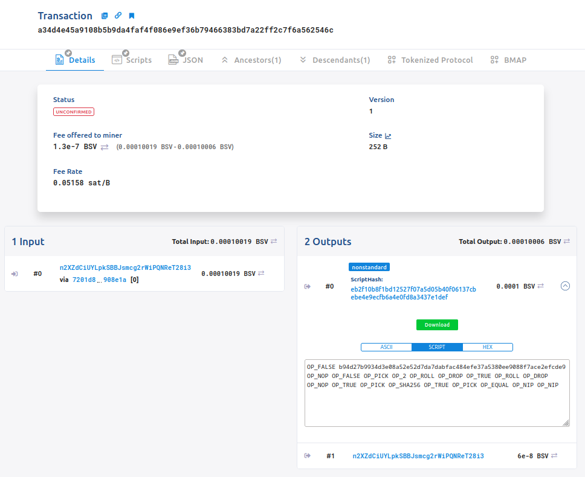
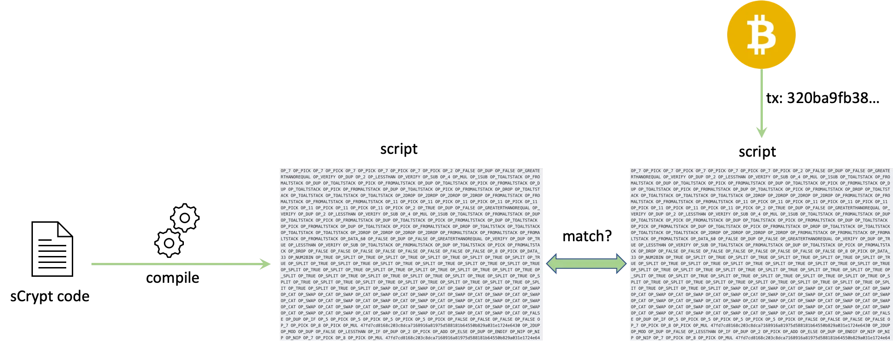
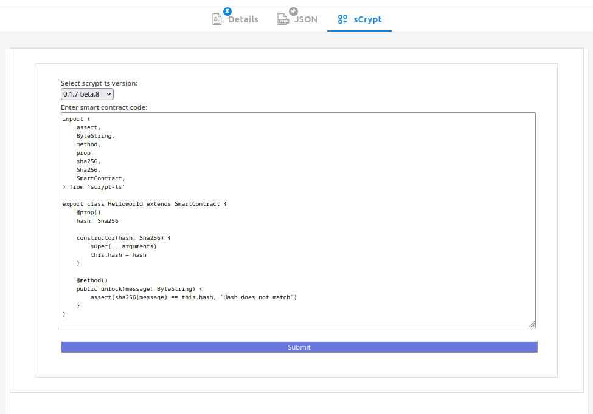

# How to Verify a Contract

You will learn how to verify smart contracts on [WhatsOnChain](https://whatsonchain.com/) (WoC), a blockchain explorer.
By verifying your smart contract on WoC, anyone can view its source code and interact with it confidently. Let's get started!


To start with the verification process, we need to first deploy a smart contract. Let us use the ["Hello World" tutorial](./tutorials/hello-world.md) as an example. After you complete the tutorial, you should get the ID of the deployment transaction such as [`a34d4e45a9108b5b9da4faf4f086e9ef36b79466383bd7a22ff2c7f6a562546c`](https://test.whatsonchain.com/tx/a34d4e45a9108b5b9da4faf4f086e9ef36b79466383bd7a22ff2c7f6a562546c).


If you take a look at the transaction on WoC, you'll see that the first output contains a script identified by the hash `eb2f10b8f1bd12527f07a5d05b40f06137cbebe4e9ecfb6a4e0fd8a3437e1def`, which contains your contract in script format.



This hash is referred to as the `scriptHash`. It's essentially just a `sha256` hash value of the deployed contracts locking script, encoded in a little-endian hex format. It is commonly used as an index by block explorers. You can also get this value locally, via the contract instance's `scriptHash` property:

```ts
console.log(instance.scriptHash)
// eb2f10b8f1bd12527f07a5d05b40f06137cbebe4e9ecfb6a4e0fd8a3437e1def
```

:::note
The scriptHash value can vary due to factors like the current property values and the number of times the contract has been updated, leading to inconsistencies in its value. 
:::

You can submit and verify sCrypt source code that belongs to a specific script hash.



There are two ways to verify it.

## 1. Using WOC sCrypt Plugin

At the deployed transaction on WOC, click on the `ScriptHash` of the first output. It will open a page like this:


You shall see an `sCrypt` tab. Click on it. You'll see a very simple form:


In the form you are able to select the version of sCrypt you've used to compile and deploy the contract, along with a text-box in which you need to paste the source code.





Now click `Submit`. If the code is correct, you should see something like the following in a few seconds:


Congrats, you have verified your first smart contract!

Now, every time someone opens the `sCrypt` tab on [the script hash page](https://test.whatsonchain.com/script/eb2f10b8f1bd12527f07a5d05b40f06137cbebe4e9ecfb6a4e0fd8a3437e1def), they will see the verified smart contract source code, as well as its constructor parameters when deployed.

## 2. Using CLI

The same process can be done using the [sCrypt CLI](https://www.npmjs.com/package/scrypt-cli). 
You can verify the deployed smart contracts script using the `verify` command:

```sh
scrypt verify <scriptHash> <contractPath>
```

The first positional argument is the script hash of the deployed contract and the second one is the path to the file which contains the sCrypt smart contract. Note, that the file must also include all the code it depends on, i.e. third party libraries.

Using the `network` option, you can specify on which network the contract is deployed. This defaults to `test`, indicating the Bitcoin testnet:

```sh
scrypt verify --network main <scriptHash> <contractPath>
```

You can also specify the version of sCrypt used during verification. By default, the command will use the version specified in `package.json`:

```sh
scrypt verify -V 0.2.0-beta.9 <scriptHash> <contractPath>
```

For example, if we would like to verify the same deployed contract as above, we would simply run the following:

```sh
scrypt verify eb2f10b8f1bd12527f07a5d05b40f06137cbebe4e9ecfb6a4e0fd8a3437e1def src/contracts/demoproject.ts
```

Upon execution, the designated contract code undergoes verification on sCrypt's servers. If successful, the outcome will be [displayed on WoC](https://test.whatsonchain.com/script/eb2f10b8f1bd12527f07a5d05b40f06137cbebe4e9ecfb6a4e0fd8a3437e1def), under the "sCrypt" tab, just like above.

