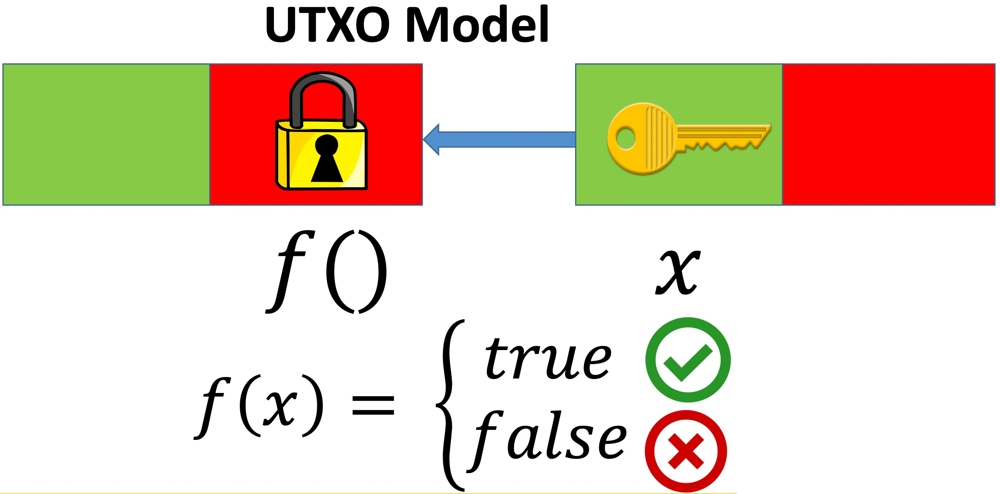

# Overview

`sCrypt` is an `embedded Domain Specific Language` ([eDSL](https://en.wikipedia.org/wiki/Domain-specific_language#External_and_Embedded_Domain_Specific_Languages)) based on TypeScript for writing smart contracts on Bitcoin SV. `Embedded` means that it is a language inside another language. `sCrypt` is strictly a subset of TypeScript, so all `sCrypt` code is valid TypeScript, but not vice versa.

We choose [TypeScript](https://www.typescriptlang.org) as the host language because it provides an easy, familiar language (JavaScript), but with type safety, making it easy to get started writing safe smart contracts. There is no need to learn a new programming language or tools, if you are already familiar with TypeScript/JavaScript.
If you're new to TypeScript, check out this helpful [introductory video](https://www.youtube.com/watch?v=ahCwqrYpIuM).

## How do Bitcoin Smart Contracts work?

Smart contracts on Bitcoin are based on the UTXO model, which is very different from an account model like Ethereum used.

### UTXO model

Each bitcoin transaction consists of some inputs and outputs.
An output contains:

- The amount of bitcoins it contains.
- bytecodes (called the `locking script`).

while an input contains:
- A reference to the previous transaction output.
- bytecodes (the `unlocking script`).

An Unspent Transaction Output (UTXO) is an output not consumed in any transaction yet. The low-level bytecode/opcode is called [Bitcoin Script](https://wiki.bitcoinsv.io/index.php/Script), which is interpreted by the [Bitcoin Virtual Machine](https://xiaohuiliu.medium.com/introduction-to-bitcoin-smart-contracts-9c0ea37dc757) (BVM).

In the example above, we have two transactions, each having one input (in green) and one output (in red). And the transaction on the right spends the one on the left.
The locking script can be regarded as a boolean function `f` that specifies conditions to spend the bitcoins in the UTXO, acting as a lock (thus the name "locking").
The unlocking script in turns provides the function arguments that makes `f` evaluates to `true`, i.e., the "key" (also called witness) needed to unlock.
Only when the “key” in an input matches previous output’s “lock”, it can spend bitcoins contained in the output.

In a regular Bitcoin payment to a [Bitcoin address](https://wiki.bitcoinsv.io/index.php/Bitcoin_address), the locking script is [Pay To Pubkey Hash (P2PKH)](https://learnmeabitcoin.com/technical/p2pkh). It checks the spender has the right private key corresponding to the address so she can produce a valid signature in the unlocking script. The expressive Script enables the locking script to specify arbitrarily more complex spending conditions than simple P2PKH, i.e., Bitcoin smart contracts.

## How does `sCrypt` work?

`sCrypt` is a high-level language to be compiled into [Bitcoin Script](https://wiki.bitcoinsv.io/index.php/Script). The resulting assembly-like scripts could be used as locking scripts when building transactions.

## Learn `sCrypt`

Jump over to the [Installation](./installation.md) section to learn how to create an `sCrypt` project. 

:::tip
You can also follow this [Youtube series](https://www.youtube.com/playlist?list=PL0Kn1t30VSpGcbwN-bcbU1-x0fRAoq-GI).
:::

Join the `#scrypt` channel on [Bitcoin SV Discord](https://discord.gg/bsv) or [Slack](https://join.slack.com/t/scryptworkspace/shared_invite/enQtNzQ1OTMyNDk1ODU3LTJmYjE5MGNmNDZhYmYxZWM4ZGY2MTczM2NiNTIxYmFhNTVjNjE5MGYwY2UwNDYxMTQyNGU2NmFkNTY5MmI1MWM) to ask questions.
