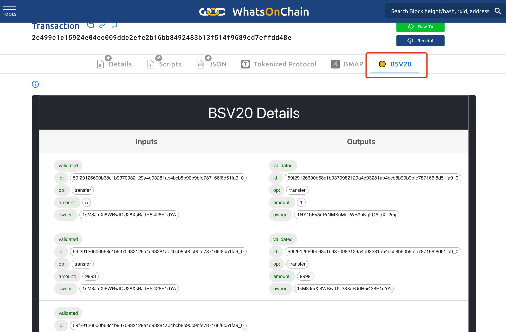
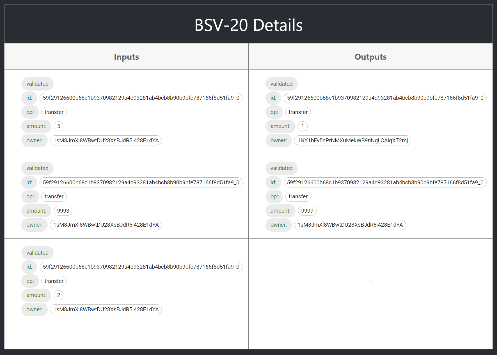
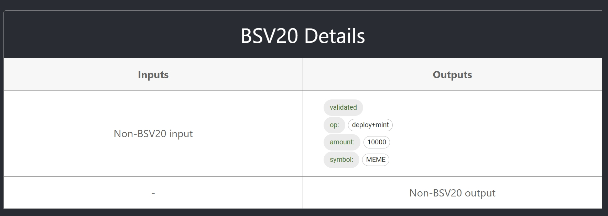

# Tutorial 5: How to verify a BSV20 token

## Overview
In this tutorial, we will go over how to use [whatsonchain](https://whatsonchain.com/) to verify a BSV20 token.


## The BSV20 plugin

For any transaction, whatsonchain can be opened via the following url:

```
https://whatsonchain.com/tx/{hash}
```

We open whatsonchain with a bsv20 v2<sup>1</sup> transaction [2c499c1c15924e04cc009ddc2efe2b16bb8492483b13f514f9689cd7effdd48e](https://whatsonchain.com/tx/2c499c1c15924e04cc009ddc2efe2b16bb8492483b13f514f9689cd7effdd48e). After opening whatsonchain you will see the BSV20 plugin:



Click on the plugin and you will see:



According to the plugin we can see the following information:

- **id:** token id
- **op:** operation in bsv20 terms
- **amount:** bsv20 token amount held by the utxo
- **owner:** bsv20 token owner

We can also see the status of bsv20 token:

- **validated:** Contains a valid bsv20 token that has been verified
- **pengding:** Contains an unverified valid bsv20 token
- **invalid:** Contains an invalid bsv20 token

If the transaction is a token deployment transaction, we will see:




A token deployment transaction does not contain any BSV20 token input. But it has other fields:

- **symbol:** the symbol of the token
- **decimals:** set decimal precision, defaults to `0`. This is different from BRC20 which defaults to 18.


------------------------

[1] Also supports bsv20 v1


