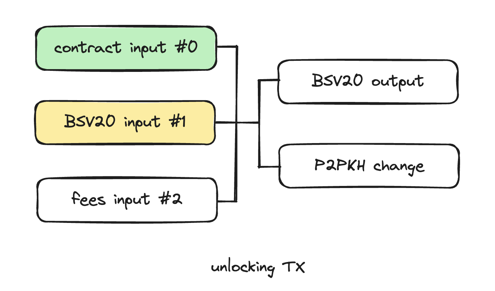

# Tutorial 5: Ordinals Oracle

## Overview
Bitcoin smart contracts can decide whether satoshis in a UTXO are valid, but cannot directly determine whether the [1SatOrdinals](https://docs.1satordinals.com/) tokens in a UTXO are valid. By inspecting a UTXO, a contract can know how many satoshis are in it since they are validated by miners on chain. However, the contract cannot be sure how many Ordinals tokens are in it or if it contains a specific NFT, since they are validated by an external indexer off chain outside of miners. In many practical applications, verifying the Ordinals tokens carried in certain transaction inputs is necessary, such as token swap and token sale. [Oracles](../../tutorials/oracle.md) must be introduced to provide additional verification for the authenticity and integrity of the Ordinals tokens required when calling a contract.

This tutorial will introduce how to use the [WitnessOnChain](https://api.witnessonchain.com) oracle to validate transaction inputs referencing UTXOs containing Ordinals NFTs and BSV20 tokens.

## WitnessOnChain API

WitnessOnChain provides an [API](https://api.witnessonchain.com/#/v1/V1Controller_getInscription) to get inscription details from an outpoint.

```
https://api.witnessonchain.com/v1/inscription/bsv/{network}/outpoint/{txid}/{vout}
```

The structure of the signed message in response is as follows:

| Name      | Type       | Bytes | Description                                  |
| --------- | ---------- | ----- | -------------------------------------------- |
| marker    | bigint     | 1     | api marker, always be 4n                     |
| timestamp | bigint     | 4     | timestamp, little-endian                     |
| network   | bigint     | 1     | network type, 1n for mainnet, 0n for testnet |
| outpoint  | ByteString | 36    | txid + output index, both in little-endian   |
| fungible  | bigint     | 1     | token type, 1n for BSV20, 0n for NFT         |
| amt       | bigint     | 8     | token amount, little endian                  |
| id        | ByteString | >=66  | inscription id                               |

According to this, we can define a customized type `Msg` and a helper parser function.

```ts
type Msg = {
    marker: bigint // 1 byte, api marker
    timestamp: bigint // 4 bytes LE
    network: bigint // 1 byte, 1 for mainnet, 0 for testnet
    outpoint: ByteString // 36 bytes, txid 32 bytes LE + vout 4 bytes LE
    fungible: bigint // 1 byte, token type, 1 for BSV20, 0 for NFT
    amt: bigint // 8 bytes LE
    id: ByteString
}

@method()
static parseMsg(msg: ByteString): Msg {
    return {
        marker: Utils.fromLEUnsigned(slice(msg, 0n, 1n)),
        timestamp: Utils.fromLEUnsigned(slice(msg, 1n, 5n)),
        network: Utils.fromLEUnsigned(slice(msg, 5n, 6n)),
        outpoint: slice(msg, 6n, 42n),
        fungible: Utils.fromLEUnsigned(slice(msg, 42n, 43n)),
        amt: Utils.fromLEUnsigned(slice(msg, 43n, 51n)),
        id: slice(msg, 51n),
    }
}
```

## Use in a Contract

In this example, we implement a demo contract, which can only be successfully called when the second input (that is input #1) of the spending transaction contains a specific amount of a certain BSV20 token.



To verify the oracle signed message, we should add oracle's public key to the contract. To record the specific BSV20 token and amount, we also need to add another two properties to it.

```ts
export class OracleDemoBsv20 extends SmartContract {
    @prop()
    oraclePubKey: RabinPubKey

    @prop()
    inscriptionId: ByteString
    @prop()
    amt: bigint

    ...
}
```

### Methods

The public method `unlock` requires three parameters:

- `msg`, oracle's signed message,
- `sig`, oracle's signature
- `tokenInputIndex`, to mark which input is the token input

```ts
@method()
public unlock(msg: ByteString, sig: RabinSig, tokenInputIndex: bigint) {
    // retrieve token outpoint from prevouts
    const outpoint = slice(this.prevouts, tokenInputIndex * 36n, (tokenInputIndex + 1n) * 36n)
    // verify oracle signature
    assert(
        WitnessOnChainVerifier.verifySig(msg, sig, this.oraclePubKey),
        'Oracle sig verify failed.'
    )
    // decode oracle data
    const message = OracleDemoBsv20.parseMsg(msg)
    // validate data
    assert(message.marker == 4n, 'incorrect oracle message type')
    assert(message.network == 0n, 'incorrect network')
    assert(message.outpoint == outpoint, 'incorrect token outpoint')
    assert(message.fungible == 1n, 'incorrect token type')
    assert(message.amt >= this.amt, 'incorrect token amount')
    assert(message.id == this.inscriptionId, 'incorrect inscription id')

    // do other validations ...
}
```

We first retrieve the token outpoint from `this.prevouts`. We parse the message signed by the oracle and verify it against the outpoint. Now we can use the token information confidently in the remaining contract code, like amount and id.

## Conclusion

Congratulations! You have successfully completed a tutorial about how to validate 1SatOrdinals inputs with Oracle.

The full example [contract](https://github.com/sCrypt-Inc/boilerplate/blob/master/src/contracts/oracleDemoBsv20.ts) and its corresponding [test](https://github.com/sCrypt-Inc/boilerplate/blob/master/tests/oracleDemoBsv20.test.ts) can be found in our [boilerplate repo](https://github.com/sCrypt-Inc/boilerplate).
