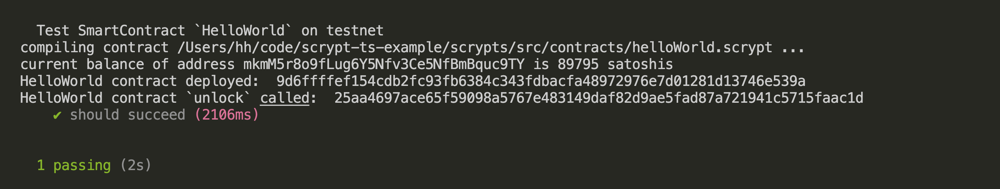
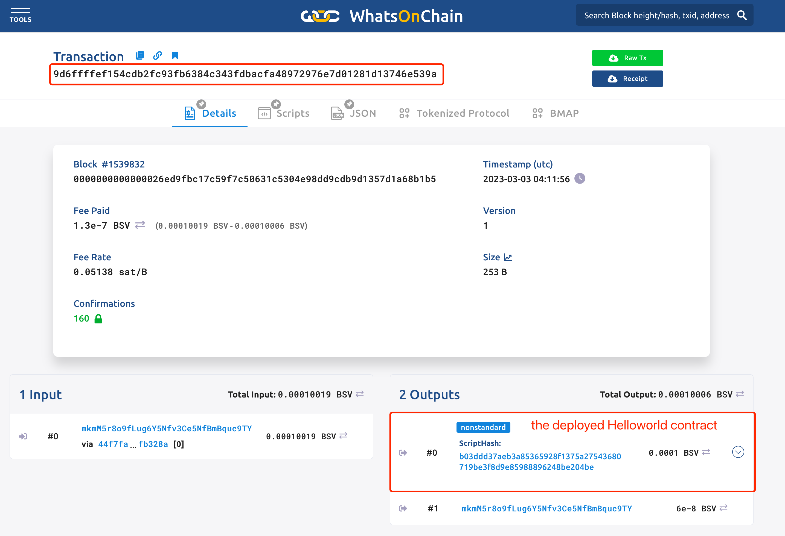

# Tutorial 1: Hello World


## Overview
In this tutorial, we will go over how to quickly create a “Hello World” smart contract, deploy and call it.

## Create a new project

Make sure [all prerequisite tools](../installation) are installed.

Run the following commands to create a new project:

```sh
scrypt project helloworld
cd helloworld
npm install
```

The resulting project will contain a sample smart contract `src/contracts/helloworld.ts`, along with all the scaffolding. Let's modify it to the following code:


```ts
import { assert, ByteString, method, prop, sha256, Sha256, SmartContract } from 'scrypt-ts'

export class Helloworld extends SmartContract {

    @prop()
    hash: Sha256;

    constructor(hash: Sha256){
        super(...arguments);
        this.hash = hash;
    }

    @method()
    public unlock(message: ByteString) {
        assert(sha256(message) == this.hash, 'Hash does not match')
    }
}
```

The `Helloworld` contract stores the sha256 hash of a message in the contract property `hash`. Only a message which hashes to the value set in `this.hash` will unlock the contract.

Now let’s look at what is in the smart contract.


- `SmartContract`: all smart contracts must extend the `SmartContract` base class.

- `@prop`:  the [`@prop` decorator](../how-to-write-a-contract/how-to-write-a-contract.md#properties) marks a contract property.

- `@method`: the [`@method` decorator](../how-to-write-a-contract/how-to-write-a-contract.md#method-decorator) marks a contract method. A [public method](../how-to-write-a-contract/#public-methods) is an entry point to a contract.

- `assert`: throws an error and makes the method call fail if its first argument is `false`. Here it ensures the passed message hashed to the expected digest.


## Contract Deployment & Call

Before we deploy the contract, follow [the instruction](../how-to-deploy-and-call-a-contract/how-to-deploy-and-call-a-contract.md#setup) to fund a Bitcoin key.

1. To [deploy a smart contract](../how-to-deploy-and-call-a-contract/how-to-deploy-and-call-a-contract.md#contract-deployment), simply call its `deploy` method.

2. To [call a smart contract](../how-to-deploy-and-call-a-contract/how-to-deploy-and-call-a-contract.md#contract-call), call one of its public method.

Let's create a file named `deploy.ts` in the root of the project, containing code to deploy and call the `Helloworld` contract:

```ts
import { Helloworld } from './src/contracts/helloworld'
import { getDefaultSigner } from './tests/testnet/utils/txHelper'
import { toByteString, sha256 } from 'scrypt-ts'

(async () => {

    const message = toByteString('hello world', true)

    await Helloworld.compile()
    const instance = new Helloworld(sha256(message))

    // connect to a signer
    await instance.connect(getDefaultSigner())

    // deploy the contract and lock up 42 satoshis in it
    const deployTx = await instance.deploy(42)
    console.log('Helloworld contract deployed: ', deployTx.id)

    // contract call
    const { tx: callTx } = await instance.methods.unlock(message)
    console.log('Helloworld contract `unlock` called: ', callTx.id)

})()
```

Run the following command:
```
npx ts-node deploy.ts
```
You will see some output like:




You can view [the deployment transaction](https://test.whatsonchain.com/tx/b10744292358eda2cfae3baae5cd486e30136b086011f7953aed9098f62f4245) using the WhatsOnChain blockchain explorer:




You can also view [the calling transaction](https://test.whatsonchain.com/tx/f28175616b6dd0ebe2aad41505aabb5bf2864e2e6d1157168183f51b6194d3e6):


Congrats! You have deployed and called your first Bitcoin smart contract.


