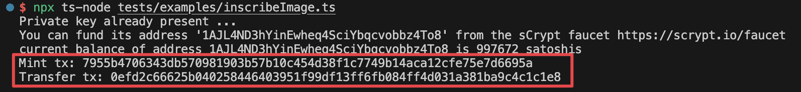
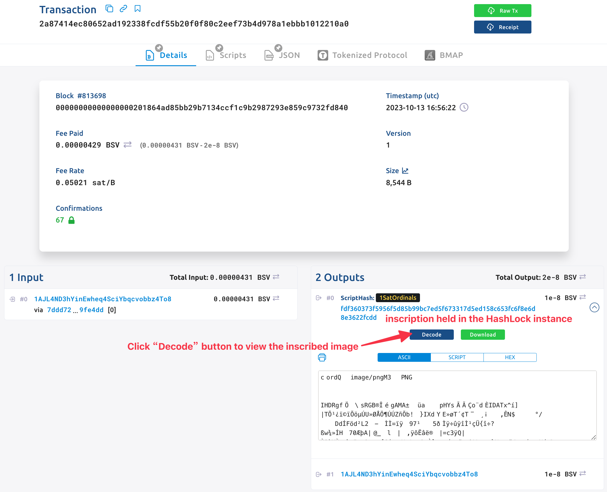
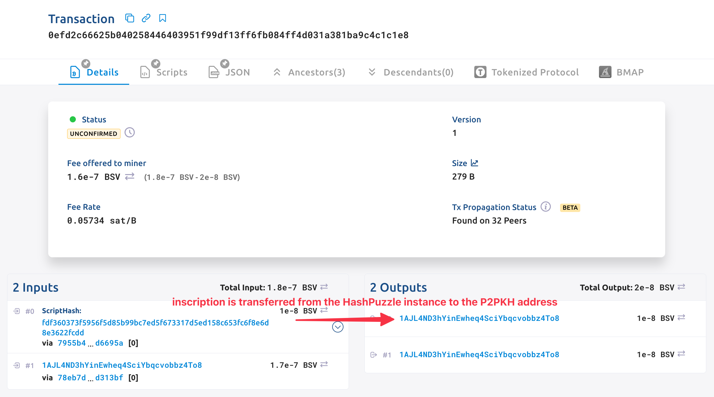

# Tutorial 8: Inscribe Image

## Overview

In this tutorial, we will use contract [HashLock](https://github.com/sCrypt-Inc/boilerplate/blob/master/src/contracts/hashLock.ts) as an example, to introduce how to inscribe an image with [sCrypt](https://scrypt.io/) and transfer the [1Sat Ordinals](https://docs.1satordinals.com/) with a Smart Contract.

:::note
The contract instance must be funded with some BSV before inscribing the image.
:::

To enable all these features, you should install `scrypt-ord` as an dependency in your project.

```bash
npm install scrypt-ord
```

## Contract

The new contract `HashLockNFT` is almost the same as the previous [implementation](https://github.com/sCrypt-Inc/boilerplate/blob/master/src/contracts/hashLock.ts), except it must be derived from `OrdinalNFT` instead of `SmartContract`.

```ts
class HashLockNFT extends OrdinalNFT {
    ...
}
```

The contract also stores a hash value in the contract, and it will be unlocked successfully when calling the public method `unlock` with the correct message.

```ts
class HashLockNFT extends OrdinalNFT {
    @prop()
    hash: Sha256
    
    ...
    
    @method()
    public unlock(message: ByteString) {
        assert(this.hash == sha256(message), 'hashes are not equal')
    }
}
```

The base class `OrdinalNFT` encapsulated helper functions to handle ordinals. If you want to create your own contract that can interact with the Ordinal NFT, derive from it.

## Inscribe Image

Things get easier. We first create an instance of contract `HashLockNFT`, then call `inscribeImage` on the instance to inscribe an image.

```ts
// create contract instance
const message = toByteString('Hello sCrpyt', true)
const hash = sha256(message)
const hashLock = new HashLockNFT(hash)
...
// inscribe image into contract
const image = readImage()
const mintTx = await hashLock.inscribeImage(image, 'image/png')
```

Execute command `npx ts-node tests/examples/inscribeImage.ts` to run this example.



Then you can check your inscription on the explorer as below, or [view the image](https://ordinals.gorillapool.io/api/files/inscriptions/2a87414ec80652ad192338fcdf55b20f0f80c2eef73b4d978a1ebbb1012210a0_0) via [1Sat Ordinals API](https://ordinals.gorillapool.io/api/docs/).





Normally, we use a P2PKH address to receive the inscription, then the inscription is controlled by a private key the same as the general P2PKH.

In this example, the inscription is sent to a contract instance, it is controlled by the smart contract, which means it can only be transferred when the hash lock is unlocked.

## Transfer the Inscription

For now, the contract instance holds the inscription and we try to transfer it to a P2PKH address.

### Step 1. Create Receiver Instance

Class `OrdNFTP2PKH` represents a P2PKH address that can hold inscriptions. Its constructor takes one parameter which is the receiving address.

```ts
const receiver = new OrdNFTP2PKH(Addr(address.toByteString()))
```

### Step 2. Call the Contract

Just as other [contract calling](../how-to-deploy-and-call-a-contract/how-to-deploy-and-call-a-contract.md#contract-call) methods we introduced before, we call the public method `unlock` of `HashLockNFT` as follows.

```ts
const { tx: transferTx } = await hashLock.methods.unlock(
    message,
    {
        transfer: receiver,  // <-----
    } as MethodCallOptions<HashLockNFT>
)
```

To represent the receiver, we only need to pass the receiver instance to the key `transfer` of struct `MethodCallOptions`.

### Benefits of Using Smart Contracts
Smart Contracts offer a number of benefits for inscribing and transferring inscriptions, including:

The ability to create complex and efficient transactions. For example, we could use a Smart Contract to create a marketplace for inscriptions, where buyers and sellers can interact in a secure and trustless manner.

The ability to implement custom logic. For example, we could use a Smart Contract to create a voting system, where users can vote on inscriptions using their BSV.

Overall, Smart Contracts offer a powerful and flexible way to interact with inscriptions on the BSV blockchain.

## Conclusion

Great! You have finished the tutorial on how to inscribe and transfer the 1Sat Ordinals inscription with a Smart Contract.

The full complete [contract](https://github.com/sCrypt-Inc/scrypt-ord/blob/master/tests/contracts/hashLockNFT.ts) and [example](https://github.com/sCrypt-Inc/scrypt-ord/blob/master/tests/examples/inscribeImage.ts) can be found in sCrypt's [repository](https://github.com/sCrypt-Inc/scrypt-ord).
