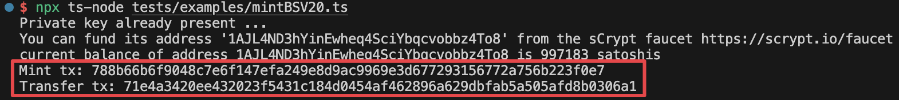
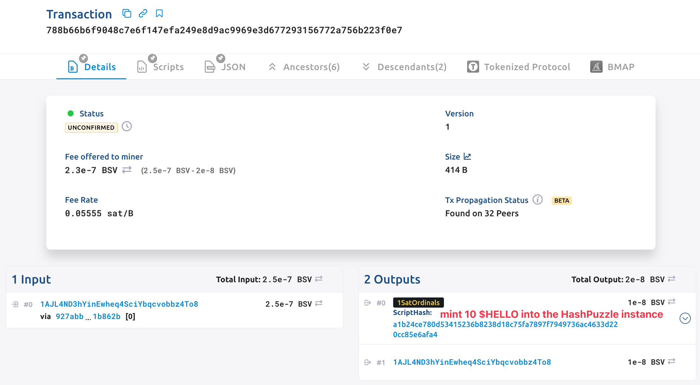
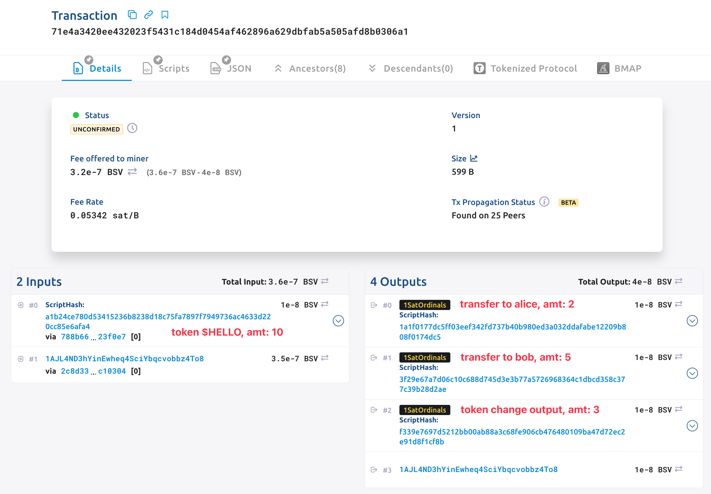

# Tutorial 10: Mint BSV20 V1 Token

## Overview

In this tutorial, we will use contract [HashLock](https://github.com/sCrypt-Inc/boilerplate/blob/master/src/contracts/hashLock.ts) as an example, to introduce how to mint a BSV20 Token (**version 1**) with [sCrypt](https://scrypt.io/) and transfer it with a Smart Contract.

To enable all these features, you should install `scrypt-ord` as an dependency in your project.

```bash
npm install scrypt-ord
```

## Contract

The new contract `HashLockFT` is almost the same as the previous [implementation](https://github.com/sCrypt-Inc/boilerplate/blob/master/src/contracts/hashLock.ts), except two differences.

1. It must be derived from `BSV20V1` instead of `SmartContract`.

```ts
class HashLockFT extends BSV20V1 {
    ...
}
```

2. The constructor has extra parameters - `tick`, `max`, `lim`, and `dec` - representing [BSV20 fields](https://docs.1satordinals.com/bsv20#v1-deploy-first-is-first-mode-only).

```ts
constructor(tick: ByteString, max: bigint, lim: bigint, dec: bigint, hash: Sha256) {
    super(tick, max, lim, dec)
    this.init(...arguments)
    this.hash = hash
}
```

The contract also stores a hash value in the contract, and it will be unlocked successfully when calling the public method `unlock` with the correct message.

```ts
class HashLockFT extends BSV20V1 {
    @prop()
    hash: Sha256
    
    ...
    
    @method()
    public unlock(message: ByteString) {
        assert(this.hash == sha256(message), 'hashes are not equal')
    }
}
```

The base class `BSV20V1` encapsulated helper functions to handle BSV20 (version 1) tokens. If you want to create your own contract that can interact with BSV20 protocol, derive from it.

## Deploy and Mint

For BSV20 version 1, tokens must be deployed before mint. We first create an instance of contract `HashLockFT`, then call function `deployToken` to deploy the new token, and call `mint` at last to mint tokens into the contract instance.

```ts
// BSV20 fields
const tick = toByteString('HELLO', true)
const max = 100n
const lim = 10n
const dec = 0n
// create contract instance
const message = toByteString('Hello sCrypt', true)
const hash = sha256(message)
const hashLock = new HashLockFT(tick, max, lim, dec, hash)
...
// deploy the new BSV20 token $HELLO
await hashLock.deployToken()
// mint 10 $HELLO into contract instance
const mintTx = await hashLock.mint(10n)
```

Normally, we use a P2PKH address to receive the token, then the token is controlled by a private key the same as the general P2PKH.

In this example, the token is mint to a contract instance, it is controlled by the smart contract, which means it can only be transferred when the hash lock is unlocked.

## Transfer Token

For now, the contract instance holds the token and we try to transfer it to a P2PKH address.

### Step 1. Create Receiver Instance

Class `BSV20V1P2PKH` represents a P2PKH address that can hold BSV20 version 1 tokens. Its constructor takes BSV20 fields and an receiving address as parameters.

```ts
const alice = new BSV20V1P2PKH(tick, max, lim, dec, addressAlice)
const bob = new BSV20V1P2PKH(tick, max, lim, dec, addressBob)
```

### Step 2. Call the Contract

Just as other [contract calling](../how-to-deploy-and-call-a-contract/how-to-deploy-and-call-a-contract.md#contract-call) methods we introduced before, we call the public method `unlock` of `HashLockFT` as follows.

```ts
// Call the contract
const { tx: transferTx } = await hashLock.methods.unlock(message, {
    transfer: [
        {
            instance: alice,
            amt: 2n,
        },
        {
            instance: bob,
            amt: 5n,
        },
    ],
} as OrdiMethodCallOptions<HashLockFT>)
```

This code will create a transaction that transfers 2 tokens to `alice` and 5 to `bob`.

The default transaction builder will automatically add a token change output on the transaction. In this example, it will automatically add a token change output with 3 tokens, paying to the default address of the instance connected signer. You can also specify the token change address by passing the value to the key `tokenChangeAddress` of struct `OrdiMethodCallOptions`.

Execute command `npx ts-node tests/examples/mintBSV20.ts` to run this example.



Then you can check your token transfer details on the explorer.





The UTXO model is a powerful feature of BSV20, we can send tokens to multiple receivers in a single transaction, allowing us to create complex and efficient transactions.

## Conclusion

Great! You have finished the tutorial on how to mint and transfer the BSV20 Token with a Smart Contract.

The full complete [contract](https://github.com/sCrypt-Inc/scrypt-ord/blob/master/tests/contracts/hashLockFT.ts) and [example](https://github.com/sCrypt-Inc/scrypt-ord/blob/master/tests/examples/mintBSV20.ts) can be found in sCrypt's [repository](https://github.com/sCrypt-Inc/scrypt-ord).
