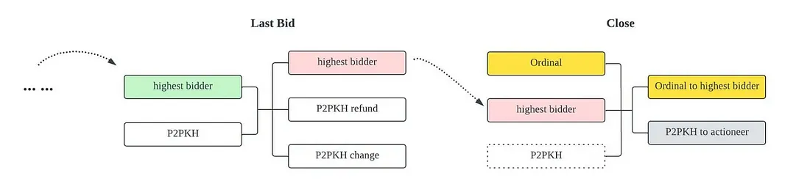
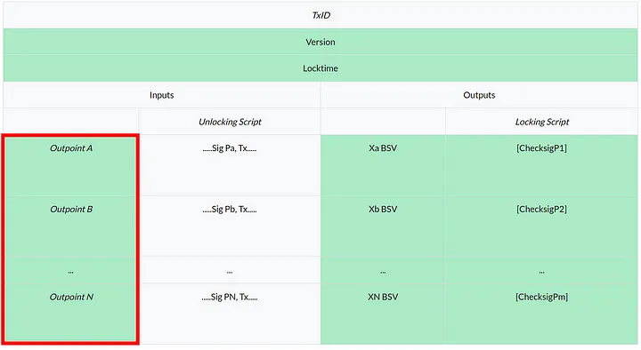

# Tutorial 9: Ordinal Auction

## Overview

In this tutorial, we will go over how to build an ordinal-auction contract. It is open and transparent, where everyone can participate and the highest bidder wins and recieved the Ordinal when the bidding is over.

There are two ways to interact with the contract:

1. Bid: if a higher bid is found, the current highest bidder is updated, and the previous highest bidder is refunded.
2. Close: the auctioneer can close the auction after it expires and take the offer.

## Contract Properties

According to the interactions above, this contract needs to store four (4) properties:

- The output of auctioned ordinal
- The auctioneer, who starts the auction
- The deadline for the auction
- The highest bidder until now

```ts
 // Output of auctioned ordinal (txid + vout).
    @prop()
    readonly ordinalPrevout: ByteString

    // The bidder's public key.
    @prop(true)
    bidder: PubKey

    // The auctioneer's public key.
    @prop()
    readonly auctioneer: PubKey

    // Deadline of the auction. Can be block height or timestamp.
    @prop()
    readonly auctionDeadline: bigint
```

## Constructor

Initialize all the `@prop` properties in the constructor. Note that we don't need to pass a `bidder` parameter, because the first bidder is the auctioneer.

```ts
 constructor(
        ordinalPrevout: ByteString,
        auctioneer: PubKey,
        auctionDeadline: bigint
    ) {
        super(...arguments)
        this.ordinalPrevout = ordinalPrevout
        this.bidder = auctioneer
        this.auctioneer = auctioneer
        this.auctionDeadline = auctionDeadline
    }
```

When deploying the contract, the auctioneer locked the minimal bid into the contract, and at this time, the highest bidder would be himself.

```ts
const instance = new OrdinalAuction(
  ordinalPrevout,
  publicKeyAuctioneer,
  auctionDeadline
);
const deployTx = await instance.deploy(minBid);
```

## Public Methods

### Bid

When there is a higher bid, the current highest bidder is updated and the previous highest bidder is refunded.
We can read the previous highest bid from the balance of the contract UTXO.

```ts
const highestBid: bigint = this.ctx.utxo.value;
```

Then it's easy to demand a higher bid.

```ts
assert(
  bid > highestBid,
  "the auction bid is lower than the current highest bid"
);
```

The spending/redeeming tx has these outputs.


The above diagram shows two such bidding transactions, where Bob and then Charlies successfully bids.
They both have 3 inputs and 2 outputs.

```ts
@method()
public bid(bidder: PubKey, bid: bigint) {
    const highestBid: bigint = this.ctx.utxo.value
    assert(
        bid > highestBid,
        'the auction bid is lower than the current highest bid'
    )

    // Change the public key of the highest bidder.
    const highestBidder: PubKey = this.bidder
    this.bidder = bidder

    // Auction continues with a higher bidder.
    const auctionOutput: ByteString = this.buildStateOutput(bid)

    // Refund previous highest bidder.
    const refundOutput: ByteString = Utils.buildPublicKeyHashOutput(
        hash160(highestBidder),
        highestBid
    )
    let outputs: ByteString = auctionOutput + refundOutput

    // Add change output.
    outputs += this.buildChangeOutput()

    assert(
        hash256(outputs) == this.ctx.hashOutputs,
        'hashOutputs check failed'
    )
}
```

The **_bid_** method is pretty straightforward. It first checks if the bid is sufficiently large. If so,
it updates the highest bidders. In the rest, it checks the new transaction’s outputs.
The first output is just the next instance of the auction with updated state. The value locked in this output will be equal to the new bid.
The second output will pay back the last highest bidder with the amount they were bidding. Lastly it adds change output.

### Close

when the auction expires, the auctioneer can close it and take the offer.
The auctioneer must also transfers the ordinal to the highest bidder. This is where the contract controls.



The above diagram shows a close transaction on the right. It differs from a bidding transaction in inputs and outputs.

There is an additional input (first input) containing the ordinal we are auctioning off
There is an output (first output) transfering the ordinal to the winning bidder.
The contract is called in the second input, while the ordinal is referenced in the first. They are in separate UTXOs, yet the contract can control the transfer of the ordinal.

Method `public close(sig: Sig)` is simple, we require:

```ts
// Output of auctioned ordinal (txid + vout).
@prop()
readonly ordnialPrevout: ByteString

@method()
public close(sigAuctioneer: Sig) {
    // Check if using block height.
    assert(
        this.timeLock >= this.auctionDeadline,
        'auction is not over yet'
    )

    // Check signature of the auctioneer.
    assert(
        this.checkSig(sigAuctioneer, this.auctioneer),
        'signature check failed'
    )

    // Ensure the first input in spending the auctioned ordinal UTXO.
    assert(
        slice(this.prevouts, 0n, 36n) == this.ordnialPrevout,
        'first input is not spending specified ordinal UTXO'
    )

    // Ensure the 1sat ordinal is being paid out to the winning bidder.
    let outputs = Utils.buildPublicKeyHashOutput(hash160(this.bidder), 1n)

    // Ensure the second output is paying the bid to the auctioneer.
    outputs += Utils.buildPublicKeyHashOutput(
        hash160(this.auctioneer),
        this.ctx.utxo.value
    )

    // Add change output.
    outputs += this.buildChangeOutput()

    // Check outputs.
    assert(hash256(outputs) == this.ctx.hashOutputs, 'hashOutputs mismatch')
}
```

- It can only be called by the auctioneer. That is why we need to pass in the caller's signature.

```ts
// Check signature of the auctioneer.
assert(this.checkSig(sig, this.auctioneer), "signature check failed");
```

- Now the auction deadline has passed

```ts
assert(this.timeLock >= this.auctionDeadline, "auction is not over yet");
```

The close method is slightly more involved. First, it checks that the call is made after the deadline using a typical [time-lock](https://docs.scrypt.io/tutorials/timeLock) pattern.
It then authenticates the auctioneer’s signature, auctioneer is the only one allowed to close the auction.



[this.prevouts](https://docs.scrypt.io/how-to-write-a-contract/scriptcontext/#prevouts) in ScriptContext contains all pointers to the UTXOs referenced in the inputs, called outpoints. An outpoint contains two parts:

- TXID: 32 bytes
- Output index: 4 bytes.

A UTXO is in the output of a transaction uniquely identified by such an outpoint.

we extract the outpoint of the first input (first 36 bytes) and compare it against the actual ordinal’s UTXO,
hardcoded when the auction starts and the contract is deployed. This ensures the authenticity of the ordinal and it cannot be fabricated.

We then construct and confirm the outputs as before. The first output is a regular P2PKH transfer to the highest bidder.
The second output pays the auctioneer. Finally, we add change outputs if necessary.

**_Note the contract ensures the ordinal comes in the first input, so it ends up in the first output and gets transferred to the winner_**

## Customize tx builder for `bid`

Using [default tx builder](../how-to-deploy-and-call-a-contract/how-to-customize-a-contract-tx.md#default-1) cannot meet our demand when calling `bid`, since the second output - the refund P2PKH output - is not a new contract instance.

In Function `static bidTxBuilder(current: Auction, options: MethodCallOptions<Auction>, bidder: PubKey, bid: bigint): Promise<ContractTransaction>`, we add all three outputs as designed.

```ts
 static buildTxForBid(
        current: OrdinalAuction,
        options: MethodCallOptions<OrdinalAuction>,
        bidder: PubKey,
        bid: bigint
    ): Promise<ContractTransaction> {
        const next = options.next as StatefulNext<OrdinalAuction>

        const unsignedTx: Transaction = new Transaction()
            // add contract input
            .addInput(current.buildContractInput())
            // build next instance output
            .addOutput(
                new Transaction.Output({
                    script: next.instance.lockingScript,
                    satoshis: Number(bid),
                })
            )
            // build refund output
            .addOutput(
                new Transaction.Output({
                    script: Script.fromHex(
                        Utils.buildPublicKeyHashScript(
                            pubKey2Addr(current.bidder)
                        )
                    ),
                    satoshis: current.balance,
                })
            )

        if (options.changeAddress) {
            // build change output
            unsignedTx.change(options.changeAddress)
        }
```

Congratulations, you have completed the `Ordinal Auction` contract! To learn more, you can refer to this example of [an NFT auction](https://xiaohuiliu.medium.com/integrate-ordinals-with-smart-contracts-on-bitcoin-part-2-d638b7ca3742).

The [final complete code](https://github.com/sCrypt-Inc/boilerplate/blob/master/src/contracts/ordinalAuction.ts) is as follows:

```ts
import {
  assert,
  MethodCallOptions,
  ContractTransaction,
  ByteString,
  hash256,
  method,
  prop,
  PubKey,
  Sig,
  SmartContract,
  Utils,
  bsv,
  slice,
  StatefulNext,
  pubKey2Addr,
} from "scrypt-ts";

import Transaction = bsv.Transaction;
import Script = bsv.Script;

export class OrdinalAuction extends SmartContract {
  // Output of auctioned ordinal (txid + vout).
  @prop()
  readonly ordinalPrevout: ByteString;

  // The bidder's public key.
  @prop(true)
  bidder: PubKey;

  // The auctioneer's public key.
  @prop()
  readonly auctioneer: PubKey;

  // Deadline of the auction. Can be block height or timestamp.
  @prop()
  readonly auctionDeadline: bigint;

  constructor(
    ordinalPrevout: ByteString,
    auctioneer: PubKey,
    auctionDeadline: bigint
  ) {
    super(...arguments);
    this.ordinalPrevout = ordinalPrevout;
    this.bidder = auctioneer;
    this.auctioneer = auctioneer;
    this.auctionDeadline = auctionDeadline;
  }

  // Call this public method to bid with a higher offer.
  @method()
  public bid(bidder: PubKey, bid: bigint) {
    const highestBid: bigint = this.ctx.utxo.value;
    assert(
      bid > highestBid,
      "the auction bid is lower than the current highest bid"
    );

    // Change the public key of the highest bidder.
    const highestBidder: PubKey = this.bidder;
    this.bidder = bidder;

    // Auction continues with a higher bidder.
    const auctionOutput: ByteString = this.buildStateOutput(bid);

    // Refund previous highest bidder.
    const refundOutput: ByteString = Utils.buildPublicKeyHashOutput(
      pubKey2Addr(highestBidder),
      highestBid
    );
    let outputs: ByteString = auctionOutput + refundOutput;

    // Add change output.
    outputs += this.buildChangeOutput();

    assert(
      hash256(outputs) == this.ctx.hashOutputs,
      "hashOutputs check failed"
    );
  }

  // Close the auction if deadline is reached.
  @method()
  public close(sigAuctioneer: Sig) {
    // Check deadline.
    assert(this.timeLock(this.auctionDeadline), "auction is not yet over");

    // Check signature of the auctioneer.
    assert(
      this.checkSig(sigAuctioneer, this.auctioneer),
      "signature check failed"
    );

    // Ensure the first input in spending the auctioned ordinal UTXO.
    assert(
      slice(this.prevouts, 0n, 36n) == this.ordinalPrevout,
      "first input is not spending specified ordinal UTXO"
    );

    // Ensure the ordinal is being paid out to the winning bidder.
    let outputs = Utils.buildPublicKeyHashOutput(pubKey2Addr(this.bidder), 1n);

    // Ensure the second output is paying the bid to the auctioneer.
    outputs += Utils.buildPublicKeyHashOutput(
      pubKey2Addr(this.auctioneer),
      this.ctx.utxo.value
    );

    // Add change output.
    outputs += this.buildChangeOutput();

    // Check outputs.
    assert(hash256(outputs) == this.ctx.hashOutputs, "hashOutputs mismatch");
  }

  // User defined transaction builder for calling function `bid`
  static buildTxForBid(
    current: OrdinalAuction,
    options: MethodCallOptions<OrdinalAuction>,
    bidder: PubKey,
    bid: bigint
  ): Promise<ContractTransaction> {
    const next = options.next as StatefulNext<OrdinalAuction>;

    const unsignedTx: Transaction = new Transaction()
      // add contract input
      .addInput(current.buildContractInput())
      // build next instance output
      .addOutput(
        new Transaction.Output({
          script: next.instance.lockingScript,
          satoshis: Number(bid),
        })
      )
      // build refund output
      .addOutput(
        new Transaction.Output({
          script: Script.fromHex(
            Utils.buildPublicKeyHashScript(pubKey2Addr(current.bidder))
          ),
          satoshis: current.balance,
        })
      );

    if (options.changeAddress) {
      // build change output
      unsignedTx.change(options.changeAddress);
    }

    return Promise.resolve({
      tx: unsignedTx,
      atInputIndex: 0,
      nexts: [
        {
          instance: next.instance,
          atOutputIndex: 0,
          balance: next.balance,
        },
      ],
    });
  }
}
```
