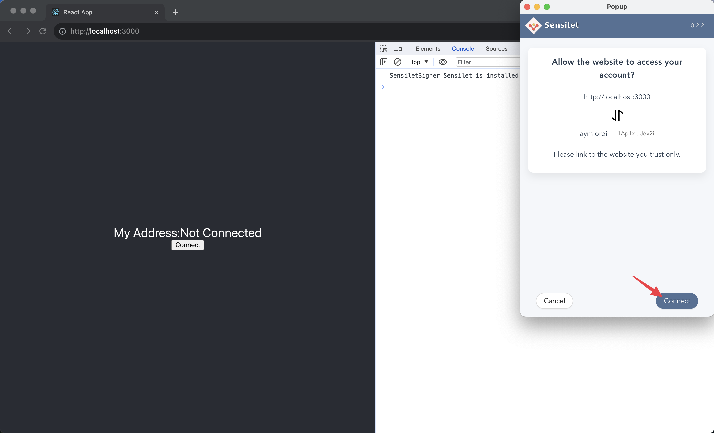
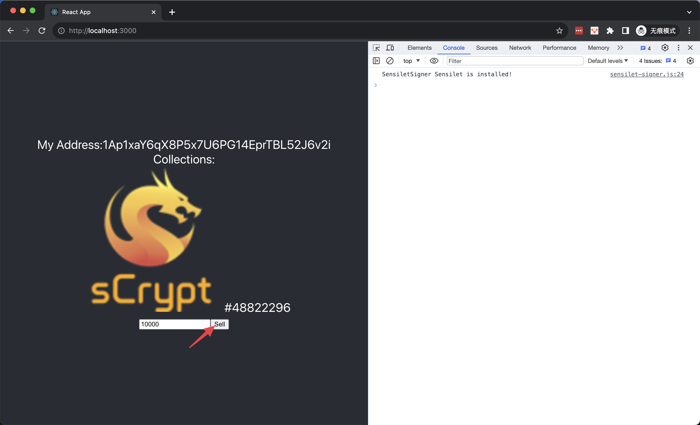
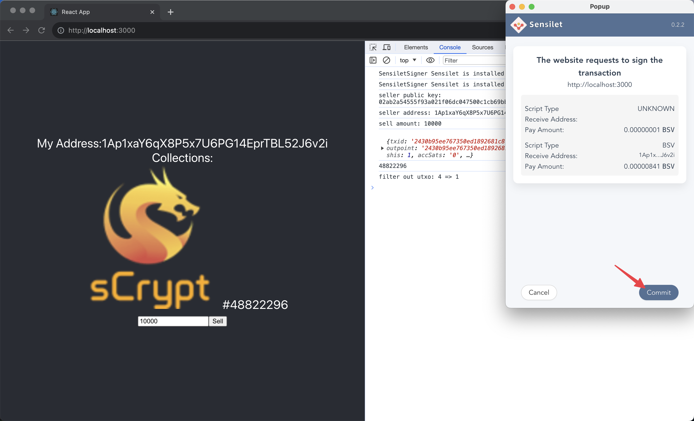
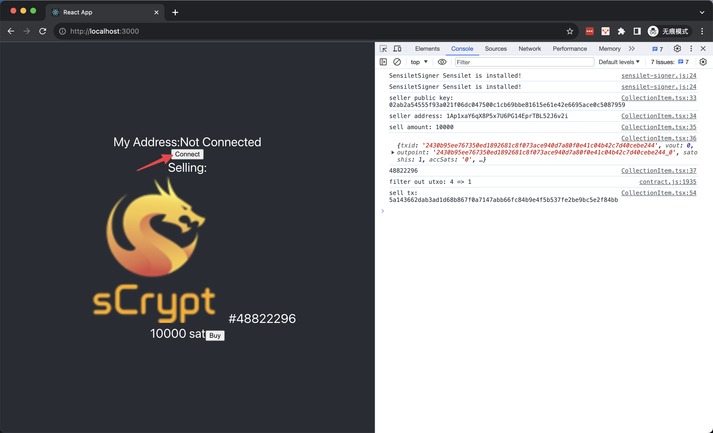

# Tutorial 8: Ordinal Lock


## Overview
In this tutorial, we will go over how to use [sCrypt](https://scrypt.io/) to build a full-stack dApp on Bitcoin to sell [1Sat Ordinals](https://docs.1satordinals.com/), including the smart contract and an interactive front-end.

## Contract

The contract [OrdinalLock](https://github.com/sCrypt-Inc/scrypt-ord/blob/master/tests/contracts/ordinalLock.ts) allows an ordinal to be offered up for sale on a decentralized marketplace. These listings can be purchased by anyone who is able to pay the requested price. Listings can also be cancelled by the person who listed them.

To record the seller and price, we need to add two properties to the contract.

```ts
export class OrdinalLock extends OrdinalNFT {
    @prop()
    seller: PubKey

    @prop()
    amount: bigint
    
    ...
}
```

### Constructor

Initialize all the `@prop` properties in the constructor.

```ts
constructor(seller: PubKey, amount: bigint) {
    super()
    this.init(...arguments)
    this.seller = seller
    this.amount = amount
}
```

### Methods

The public method `purchase` only needs to confine the transaction's outputs to contain:

- transfer ordinal to the buyer
- payment to the seller

```ts
@method()
public purchase(receiver: Addr) {
    const outputs =
        Utils.buildAddressOutput(receiver, 1n) + // ordinal to the buyer
        Utils.buildAddressOutput(hash160(this.seller), this.amount) + // fund to the seller
        this.buildChangeOutput()
    assert(this.ctx.hashOutputs == hash256(outputs), 'hashOutputs check failed')
}
```

The [final complete code](https://github.com/sCrypt-Inc/scrypt-ord/blob/master/tests/contracts/ordinalLock.ts) is as follows:

```ts
import { Addr, prop, method, Utils, hash256, assert, MethodCallOptions, ContractTransaction, bsv, PubKey, hash160 } from 'scrypt-ts'
import { OrdinalNFT } from '../scrypt-ord'

export class OrdinalLock extends OrdinalNFT {
    @prop()
    seller: PubKey

    @prop()
    amount: bigint

    constructor(seller: PubKey, amount: bigint) {
        super()
        this.init(seller, amount)
        this.seller = seller
        this.amount = amount
    }

    @method()
    public purchase(receiver: Addr) {
        const outputs =
            Utils.buildAddressOutput(receiver, 1n) + // ordinal to the buyer
            Utils.buildAddressOutput(hash160(this.seller), this.amount) + // fund to the seller
            this.buildChangeOutput()
        assert(
            this.ctx.hashOutputs == hash256(outputs),
            'hashOutputs check failed'
        )
    }

    static async buildTxForPurchase(
        current: OrdinalLock,
        options: MethodCallOptions<OrdinalLock>,
        receiver: Addr
    ): Promise<ContractTransaction> {
        const defaultAddress = await current.signer.getDefaultAddress()
        const tx = new bsv.Transaction()
            .addInput(current.buildContractInput())
            .addOutput(
                new bsv.Transaction.Output({
                    script: bsv.Script.fromHex(
                        Utils.buildAddressScript(receiver)
                    ),
                    satoshis: 1,
                })
            )
            .addOutput(
                new bsv.Transaction.Output({
                    script: bsv.Script.fromHex(
                        Utils.buildAddressScript(hash160(current.seller))
                    ),
                    satoshis: Number(current.amount),
                })
            )
            .change(options.changeAddress || defaultAddress)
        return {
            tx,
            atInputIndex: 0,
            nexts: [],
        }
    }
}
```
Note the customized calling method `buildTxForPurchase` ensures the ordinal is in the first input and goes to the first output, which is also a 1sat output.


## Frontend

We will add a frontend to the `OrdinalLock` smart contract accroding to this [guide](../how-to-integrate-a-frontend/how-to-integrate-a-frontend.md).

### Setup Project

The front-end will be created using [Create React App](https://create-react-app.dev/).

```bash
npx create-react-app ordinal-lock-demo --template typescript
```

### Install the sCrypt SDK

The sCrypt SDK enables you to easily compile, test, deploy, and call contracts.

Use the `scrypt-cli` command line to install the SDK.

```bash
cd ordinal-lock-demo
npx scrypt-cli init
```

This command will create a contract under `src/contracts`. Replace the file with the contract written [above](#final-code).

### Compile Contract

Compile the contract with the following command: 

```bash
npx scrypt-cli compile
```

This command will generate a contract artifact file under `artifacts`.

### Load Contract Artifact

Before writing the front-end code, we need to load the contract artifact in `src/index.tsx`.

```ts
import { OrdinalLock } from './contracts/ordinalLock'
import artifact from '../artifacts/ordinalLock.json'
OrdinalLock.loadArtifact(artifact)
```

### Integrate Wallet

Use `requestAuth` method of `signer` to request access to the wallet.

```ts
// request authentication
const { isAuthenticated, error } = await signer.requestAuth();
if (!isAuthenticated) {
    // something went wrong, throw an Error with `error` message
    throw new Error(error);
}

// authenticated
// ...
```

### Integrate sCrypt Service

Follow [this guide](../advanced/how-to-integrate-scrypt-service.md) to initialize the client.

```ts
Scrypt.init({
  apiKey: 'YOUR_API_KEY',
  network: bsv.Networks.mainnet
})
```

### Connect Signer to `ScryptProvider`

It's required to connect your signer to `ScryptProvider` when using sCrypt service.

```ts
const provider = new ScryptProvider();
const signer = new SensiletSigner(provider);

signerRef.current = signer;
```

### Load Ordinals

After a user connect wallet, we can get the his address. Call the 1Sat Ordinals API to retrieve ordinals on this address.

```ts
useEffect(() => {
  loadCollections()
}, [connectedAddress])

function loadCollections() {
  if (connectedAddress) {
    const url = `https://v3.ordinals.gorillapool.io/api/txos/address/${connectedAddress.toString()}/unspent?bsv20=false`
    fetch(url).then(r => r.json()).then(r => r.filter(e => e.origin.data.insc.file.type !== 'application/bsv-20')).then(r => setCollections(r))   }
}
```





### List an Ordinal

For each ordinal in the collection list, we can click the `Sell` button to list it after filling in the selling price, in satoshis. Sell an ordinal means we need to create a contract instance, and then transfer the ordinal into it. Afterwards, the ordinal is under the control of the contract, meaning it can be bought by anyone paying the price to the seller.

```ts
async function sell() {
    const signer = new SensiletSigner(new ScryptProvider())
    const publicKey = await signer.getDefaultPubKey()

    const instance = new OrdinalLock(PubKey(toHex(publicKey)), amount)
    await instance.connect(signer)

    const inscriptionUtxo = await parseUtxo(txid, vout)
    const inscriptionP2PKH = OrdNFTP2PKH.fromUTXO(inscriptionUtxo)
    await inscriptionP2PKH.connect(signer)

    const { tx } = await inscriptionP2PKH.methods.unlock(
        (sigResps) => findSig(sigResps, publicKey),
        PubKey(toHex(publicKey)),
        {
            transfer: instance,     // <---- 
            pubKeyOrAddrToSign: publicKey,
        } as MethodCallOptions<OrdNFTP2PKH>
    )
}
```






### Buy an Ordinal

To buy an ordinal that is on sale, we only need to call the contract public method `purchase`.

```ts
async function buy() {
    const signer = new SensiletSigner(new ScryptProvider())
    const address = await signer.getDefaultAddress()
    const { tx } = await instance.methods.purchase(Addr(address.toByteString()))
}
```




## Conclusion

Congratulations! You have successfully completed a full-stack dApp that can sell 1Sat Ordinals on Bitcoin.

The full example repo can be found [here](https://github.com/sCrypt-Inc/ordinal-lock-demo/tree/sensilet).
