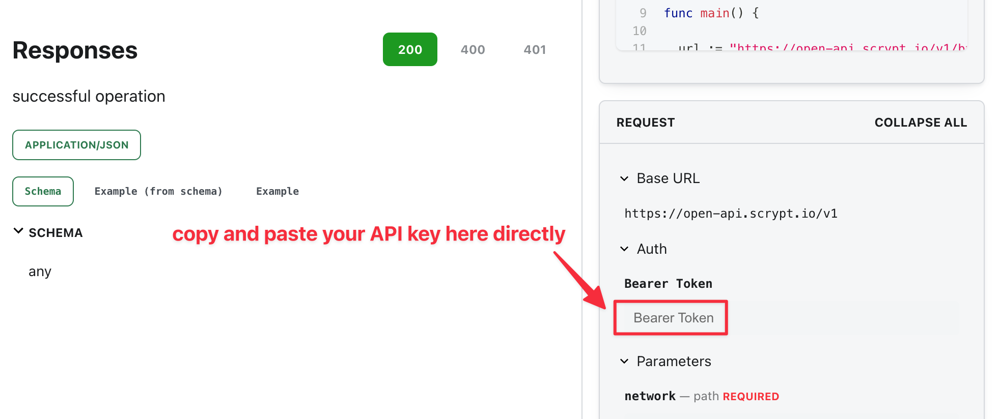

# API Overview

Our open API uses an HTTP bearer token to authenticate. You can refer to this [doc](https://docs.scrypt.io/advanced/how-to-integrate-scrypt-service#get-an-api-key) to get an API key as the bearer token.

